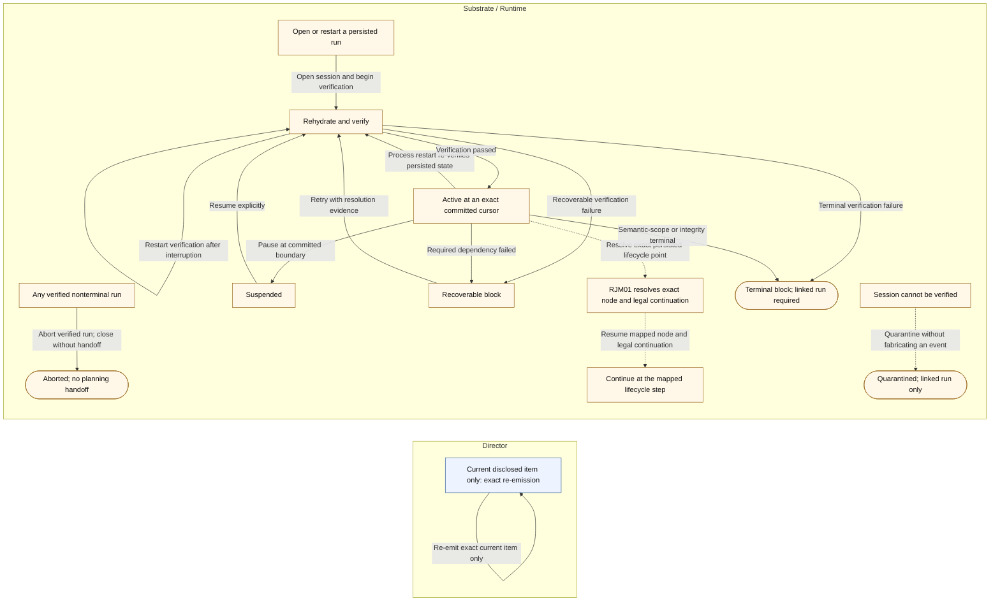

<!-- GENERATED FILE. Visible lifecycle macros are human guidance; hidden coverage resolves to the normative protocol. -->

# Director lifecycle

## Primary Director lifecycle

```mermaid
flowchart LR
    subgraph LIFECYCLE_DIRECTOR["Director"]
        direction TB
        D_OPEN["Open intent and bind Director"]
        D_Q1(["Receive and answer Q1 only"])
        D_Q2(["Receive and answer Q2 only"])
        D_Q3(["Receive and answer Q3 only"])
        D_Q4(["Receive and answer Q4 only"])
        D_Q5(["Receive and answer Q5 only"])
        D_Q6(["Receive and answer Q6 only"])
        D_WALK["Walk through the frozen candidate"]
        D_DECIDE{"Ratify the exact candidate?"}
        D_FEEDBACK["Correction or withholding recorded"]
        D_DONE(["Intent captured; planning handoff sealed"])
    end
    subgraph LIFECYCLE_PROPOSER["Proposer / Survey agent"]
        direction TB
        P_INIT["Resolve dependencies and initialize"]
        P_R1["Design, validate, and freeze Round 1"]
        P_R1_INTERPRET["Interpret and seal Round 1"]
        P_R2["Design Round 2 from sealed Round 1"]
        P_R2_INTERPRET["Interpret and seal Round 2"]
        P_COMPOSE["Compose the immutable candidate"]
        P_CLASSIFY{"Classify actionable feedback"}
        P_SCOPE_LINK["Earlier scope change: linked run required"]
    end
    subgraph LIFECYCLE_RUNTIME["Substrate / Runtime"]
        direction TB
        R_VALIDATE{"Mechanically validate candidate"}
        R_FINALIZE["Deterministically render terminal envelope"]
        R_FINAL_CHECK{"Verify terminal projection result"}
        R_ANCESTRY_LINK["Earlier invalid ancestor: linked run required"]
    end
    D_OPEN -->|"Bind intent and complete initialization"| P_INIT
    P_INIT -->|"Begin Round 1 design"| P_R1
    P_R1 -->|"Save, freeze, and present Q1"| D_Q1
    D_Q1 -->|"Accept Q1; then present Q2"| D_Q2
    D_Q2 -->|"Accept Q2; then present Q3"| D_Q3
    D_Q3 -->|"Complete and begin interpreting Round 1"| P_R1_INTERPRET
    P_R1_INTERPRET -->|"Save and seal Round 1; begin Round 2"| P_R2
    P_R2 -->|"Save, freeze, and present Q4"| D_Q4
    D_Q4 -->|"Accept Q4; then present Q5"| D_Q5
    D_Q5 -->|"Accept Q5; then present Q6"| D_Q6
    D_Q6 -->|"Complete and begin interpreting Round 2"| P_R2_INTERPRET
    P_R2_INTERPRET -->|"Save and seal Round 2; compose"| P_COMPOSE
    P_COMPOSE -->|"Save and seal candidate"| R_VALIDATE
    R_VALIDATE -->|"Validation failed; repair candidate"| P_COMPOSE
    R_VALIDATE -->|"Validation passed; begin walkthrough"| D_WALK
    D_WALK -->|"Acknowledge and show next segment"| D_WALK
    D_WALK -->|"All segments acknowledged"| D_DECIDE
    D_DECIDE -->|"Ratify exact candidate and finalize"| R_FINALIZE
    D_DECIDE -->|"Return correction or withhold"| D_FEEDBACK
    D_FEEDBACK -.->|"Classify actionable feedback"| P_CLASSIFY
    P_CLASSIFY -->|"Composite-only revision"| P_COMPOSE
    P_CLASSIFY -->|"Round 2 reinterpretation"| P_R2_INTERPRET
    P_CLASSIFY -.->|"Earlier change requires a linked run"| P_SCOPE_LINK
    D_FEEDBACK -->|"Clarify while still unratified"| D_FEEDBACK
    D_FEEDBACK -->|"Withdraw withholding; decide again"| D_DECIDE
    R_FINALIZE -.->|"Classify terminal projection"| R_FINAL_CHECK
    R_FINAL_CHECK -->|"Transient retry"| R_FINALIZE
    R_FINAL_CHECK -->|"Candidate ancestry invalid"| P_COMPOSE
    R_FINAL_CHECK -->|"Round 2 ancestry invalid"| P_R2_INTERPRET
    R_FINAL_CHECK -.->|"Earlier invalid ancestor requires linked run"| R_ANCESTRY_LINK
    R_FINAL_CHECK -->|"Seal handoff and close runtime"| D_DONE
    D_Q1 -.->|"Invalid response; repeat Q1 only"| D_Q1
    D_Q2 -.->|"Invalid response; repeat Q2 only"| D_Q2
    D_Q3 -.->|"Invalid response; repeat Q3 only"| D_Q3
    D_Q4 -.->|"Invalid response; repeat Q4 only"| D_Q4
    D_Q5 -.->|"Invalid response; repeat Q5 only"| D_Q5
    D_Q6 -.->|"Invalid response; repeat Q6 only"| D_Q6
    class D_OPEN,D_Q1,D_Q2,D_Q3,D_Q4,D_Q5,D_Q6,D_WALK,D_DECIDE,D_FEEDBACK,D_DONE director
    class P_INIT,P_R1,P_R1_INTERPRET,P_R2,P_R2_INTERPRET,P_COMPOSE,P_CLASSIFY,P_SCOPE_LINK proposer
    class R_VALIDATE,R_FINALIZE,R_FINAL_CHECK,R_ANCESTRY_LINK runtime
    classDef director fill:#eef4ff,stroke:#315a9b,color:#111
    classDef proposer fill:#eefaf2,stroke:#397a4a,color:#111
    classDef runtime fill:#fff7e8,stroke:#9a6b24,color:#111
```

## Continuity, abort, and fail-safe handling

## Reading the projection

- Solid arrows are lifecycle macros; their transition IDs are fully traced to the normative protocol FSM.
- Dashed arrows are views, classifications, rejections, or fail-safe handling and never invent protocol state.
- Lane placement names the visible touchpoint; exact transition authority remains in the normative protocol tuple.
- Continuity surrounds any persisted primary-lifecycle point; RJM01 returns to its exact mapped node and legal continuation edge set.
- The FSM remains the exhaustive legal-state authority; this FLOW is the Director-centred cognitive projection.

<!-- Machine-readable lifecycle evidence; intentionally outside Mermaid parser input. -->
<!-- @lifecycle-meta|eyIkc2NoZW1hIjoidXJuOm1pc3Npb24ta2l0OnN1cnZleS12MjpzY2hlbWE6ZGlyZWN0b3ItbGlmZWN5Y2xlOnYxIiwiZGlyZWN0aW9uIjoiTFIiLCJpZCI6InVybjptaXNzaW9uLWtpdDpzdXJ2ZXktdjI6dmlldzpkaXJlY3Rvci1saWZlY3ljbGUiLCJub3RlcyI6WyJTb2xpZCBhcnJvd3MgYXJlIGxpZmVjeWNsZSBtYWNyb3M7IHRoZWlyIHRyYW5zaXRpb24gSURzIGFyZSBmdWxseSB0cmFjZWQgdG8gdGhlIG5vcm1hdGl2ZSBwcm90b2NvbCBGU00uIiwiRGFzaGVkIGFycm93cyBhcmUgdmlld3MsIGNsYXNzaWZpY2F0aW9ucywgcmVqZWN0aW9ucywgb3IgZmFpbC1zYWZlIGhhbmRsaW5nIGFuZCBuZXZlciBpbnZlbnQgcHJvdG9jb2wgc3RhdGUuIiwiTGFuZSBwbGFjZW1lbnQgbmFtZXMgdGhlIHZpc2libGUgdG91Y2hwb2ludDsgZXhhY3QgdHJhbnNpdGlvbiBhdXRob3JpdHkgcmVtYWlucyBpbiB0aGUgbm9ybWF0aXZlIHByb3RvY29sIHR1cGxlLiIsIkNvbnRpbnVpdHkgc3Vycm91bmRzIGFueSBwZXJzaXN0ZWQgcHJpbWFyeS1saWZlY3ljbGUgcG9pbnQ7IFJKTTAxIHJldHVybnMgdG8gaXRzIGV4YWN0IG1hcHBlZCBub2RlIGFuZCBsZWdhbCBjb250aW51YXRpb24gZWRnZSBzZXQuIiwiVGhlIEZTTSByZW1haW5zIHRoZSBleGhhdXN0aXZlIGxlZ2FsLXN0YXRlIGF1dGhvcml0eTsgdGhpcyBGTE9XIGlzIHRoZSBEaXJlY3Rvci1jZW50cmVkIGNvZ25pdGl2ZSBwcm9qZWN0aW9uLiJdLCJwcm90b2NvbElkIjoidXJuOm1pc3Npb24ta2l0OnN1cnZleS12Mjpwcm90b2NvbDpzdXJ2ZXkiLCJyZWpvaW5NYXBJZCI6IlJKTTAxIiwic2NoZW1hVmVyc2lvbiI6IjEuMC4wIiwidGl0bGUiOiJTdXJ2ZXkgRGlyZWN0b3IgbGlmZWN5Y2xlIn0 -->
<!-- @lifecycle-coverage|W3siZWRnZUlkIjoiTDAxIiwibWFjaGluZSI6InBoYXNlIiwidHJhbnNpdGlvbiI6eyJhY3Rpb24iOiJBMDEiLCJhdXRob3JpdHkiOiJBVTAxIiwiZXZlbnQiOiJBQ0NFUFRfSU5JVElBTElaQVRJT04iLCJmcm9tIjoibmV3IiwiZ3VhcmQiOiJHMDEiLCJpZCI6IlQwMSIsIm11dGF0aW9uIjoiTTAxIiwidG8iOiJpbml0aWFsaXppbmcifX0seyJlZGdlSWQiOiJMMDIiLCJtYWNoaW5lIjoicGhhc2UiLCJ0cmFuc2l0aW9uIjp7ImFjdGlvbiI6IkEwMiIsImF1dGhvcml0eSI6IkFVMDEiLCJldmVudCI6IkJFR0lOX1IxX0RFU0lHTiIsImZyb20iOiJpbml0aWFsaXplZCIsImd1YXJkIjoiRzAyIiwiaWQiOiJUMDIiLCJtdXRhdGlvbiI6Ik0wMiIsInRvIjoicm91bmRfMV9kcmFmdGluZyJ9fSx7ImVkZ2VJZCI6IkwwMyIsIm1hY2hpbmUiOiJwaGFzZSIsInRyYW5zaXRpb24iOnsiYWN0aW9uIjoiQTAzIiwiYXV0aG9yaXR5IjoiQVUwMSIsImV2ZW50IjoiRlJFRVpFX1IxIiwiZnJvbSI6InJvdW5kXzFfZHJhZnRpbmciLCJndWFyZCI6IkcwMyIsImlkIjoiVDAzIiwibXV0YXRpb24iOiJNMDMiLCJ0byI6InJvdW5kXzFfcTFfcmVhZHkifX0seyJlZGdlSWQiOiJMMDMiLCJtYWNoaW5lIjoicGhhc2UiLCJ0cmFuc2l0aW9uIjp7ImFjdGlvbiI6IkEwNCIsImF1dGhvcml0eSI6IkFVMDEiLCJldmVudCI6IlJFT1BFTl9SMSIsImZyb20iOiJyb3VuZF8xX3ExX3JlYWR5IiwiZ3VhcmQiOiJHMDQiLCJpZCI6IlQwNCIsIm11dGF0aW9uIjoiTTA0IiwidG8iOiJyb3VuZF8xX2RyYWZ0aW5nIn19LHsiZWRnZUlkIjoiTDAzIiwibWFjaGluZSI6InBoYXNlIiwidHJhbnNpdGlvbiI6eyJhY3Rpb24iOiJBMDUiLCJhdXRob3JpdHkiOiJBVTAzIiwiZXZlbnQiOiJQUkVTRU5UX1ExIiwiZnJvbSI6InJvdW5kXzFfcTFfcmVhZHkiLCJndWFyZCI6IkcwNSIsImlkIjoiVDA1IiwibXV0YXRpb24iOiJNMDUiLCJ0byI6InJvdW5kXzFfcTFfYXdhaXRpbmcifX0seyJlZGdlSWQiOiJMMDQiLCJtYWNoaW5lIjoicGhhc2UiLCJ0cmFuc2l0aW9uIjp7ImFjdGlvbiI6IkEwNiIsImF1dGhvcml0eSI6IkFVMDIiLCJldmVudCI6IlJFU1BPTkRfUTEiLCJmcm9tIjoicm91bmRfMV9xMV9hd2FpdGluZyIsImd1YXJkIjoiRzA2IiwiaWQiOiJUMDYiLCJtdXRhdGlvbiI6Ik0wNiIsInRvIjoicm91bmRfMV9xMl9yZWFkeSJ9fSx7ImVkZ2VJZCI6IkwwNCIsIm1hY2hpbmUiOiJwaGFzZSIsInRyYW5zaXRpb24iOnsiYWN0aW9uIjoiQTA3IiwiYXV0aG9yaXR5IjoiQVUwMyIsImV2ZW50IjoiUFJFU0VOVF9RMiIsImZyb20iOiJyb3VuZF8xX3EyX3JlYWR5IiwiZ3VhcmQiOiJHMDciLCJpZCI6IlQwNyIsIm11dGF0aW9uIjoiTTA3IiwidG8iOiJyb3VuZF8xX3EyX2F3YWl0aW5nIn19LHsiZWRnZUlkIjoiTDA1IiwibWFjaGluZSI6InBoYXNlIiwidHJhbnNpdGlvbiI6eyJhY3Rpb24iOiJBMDgiLCJhdXRob3JpdHkiOiJBVTAyIiwiZXZlbnQiOiJSRVNQT05EX1EyIiwiZnJvbSI6InJvdW5kXzFfcTJfYXdhaXRpbmciLCJndWFyZCI6IkcwOCIsImlkIjoiVDA4IiwibXV0YXRpb24iOiJNMDgiLCJ0byI6InJvdW5kXzFfcTNfcmVhZHkifX0seyJlZGdlSWQiOiJMMDUiLCJtYWNoaW5lIjoicGhhc2UiLCJ0cmFuc2l0aW9uIjp7ImFjdGlvbiI6IkEwOSIsImF1dGhvcml0eSI6IkFVMDMiLCJldmVudCI6IlBSRVNFTlRfUTMiLCJmcm9tIjoicm91bmRfMV9xM19yZWFkeSIsImd1YXJkIjoiRzA5IiwiaWQiOiJUMDkiLCJtdXRhdGlvbiI6Ik0wOSIsInRvIjoicm91bmRfMV9xM19hd2FpdGluZyJ9fSx7ImVkZ2VJZCI6IkwwNiIsIm1hY2hpbmUiOiJwaGFzZSIsInRyYW5zaXRpb24iOnsiYWN0aW9uIjoiQTEwIiwiYXV0aG9yaXR5IjoiQVUwMiIsImV2ZW50IjoiUkVTUE9ORF9RMyIsImZyb20iOiJyb3VuZF8xX3EzX2F3YWl0aW5nIiwiZ3VhcmQiOiJHMTAiLCJpZCI6IlQxMCIsIm11dGF0aW9uIjoiTTEwIiwidG8iOiJyb3VuZF8xX3Jlc3BvbnNlc19jb21wbGV0ZSJ9fSx7ImVkZ2VJZCI6IkwwNiIsIm1hY2hpbmUiOiJwaGFzZSIsInRyYW5zaXRpb24iOnsiYWN0aW9uIjoiQTExIiwiYXV0aG9yaXR5IjoiQVUwMSIsImV2ZW50IjoiQkVHSU5fUjFfSU5URVJQUkVUQVRJT04iLCJmcm9tIjoicm91bmRfMV9yZXNwb25zZXNfY29tcGxldGUiLCJndWFyZCI6IkcxMSIsImlkIjoiVDExIiwibXV0YXRpb24iOiJNMTEiLCJ0byI6InJvdW5kXzFfaW50ZXJwcmV0aW5nIn19LHsiZWRnZUlkIjoiTDA3IiwibWFjaGluZSI6InBoYXNlIiwidHJhbnNpdGlvbiI6eyJhY3Rpb24iOiJBMTIiLCJhdXRob3JpdHkiOiJBVTAxIiwiZXZlbnQiOiJDT01NSVRfUjFfSU5URVJQUkVUQVRJT04iLCJmcm9tIjoicm91bmRfMV9pbnRlcnByZXRpbmciLCJndWFyZCI6IkcxMiIsImlkIjoiVDEyIiwibXV0YXRpb24iOiJNMTIiLCJ0byI6InJvdW5kXzFfaW50ZXJwcmV0ZWQifX0seyJlZGdlSWQiOiJMMDciLCJtYWNoaW5lIjoicGhhc2UiLCJ0cmFuc2l0aW9uIjp7ImFjdGlvbiI6IkExMyIsImF1dGhvcml0eSI6IkFVMDEiLCJldmVudCI6IkJFR0lOX1IyX0RFU0lHTiIsImZyb20iOiJyb3VuZF8xX2ludGVycHJldGVkIiwiZ3VhcmQiOiJHMTMiLCJpZCI6IlQxMyIsIm11dGF0aW9uIjoiTTEzIiwidG8iOiJyb3VuZF8yX2RyYWZ0aW5nIn19LHsiZWRnZUlkIjoiTDA4IiwibWFjaGluZSI6InBoYXNlIiwidHJhbnNpdGlvbiI6eyJhY3Rpb24iOiJBMTQiLCJhdXRob3JpdHkiOiJBVTAxIiwiZXZlbnQiOiJGUkVFWkVfUjIiLCJmcm9tIjoicm91bmRfMl9kcmFmdGluZyIsImd1YXJkIjoiRzE0IiwiaWQiOiJUMTQiLCJtdXRhdGlvbiI6Ik0xNCIsInRvIjoicm91bmRfMl9xNF9yZWFkeSJ9fSx7ImVkZ2VJZCI6IkwwOCIsIm1hY2hpbmUiOiJwaGFzZSIsInRyYW5zaXRpb24iOnsiYWN0aW9uIjoiQTE1IiwiYXV0aG9yaXR5IjoiQVUwMSIsImV2ZW50IjoiUkVPUEVOX1IyIiwiZnJvbSI6InJvdW5kXzJfcTRfcmVhZHkiLCJndWFyZCI6IkcxNSIsImlkIjoiVDE1IiwibXV0YXRpb24iOiJNMTUiLCJ0byI6InJvdW5kXzJfZHJhZnRpbmcifX0seyJlZGdlSWQiOiJMMDgiLCJtYWNoaW5lIjoicGhhc2UiLCJ0cmFuc2l0aW9uIjp7ImFjdGlvbiI6IkExNiIsImF1dGhvcml0eSI6IkFVMDMiLCJldmVudCI6IlBSRVNFTlRfUTQiLCJmcm9tIjoicm91bmRfMl9xNF9yZWFkeSIsImd1YXJkIjoiRzE2IiwiaWQiOiJUMTYiLCJtdXRhdGlvbiI6Ik0xNiIsInRvIjoicm91bmRfMl9xNF9hd2FpdGluZyJ9fSx7ImVkZ2VJZCI6IkwwOSIsIm1hY2hpbmUiOiJwaGFzZSIsInRyYW5zaXRpb24iOnsiYWN0aW9uIjoiQTE3IiwiYXV0aG9yaXR5IjoiQVUwMiIsImV2ZW50IjoiUkVTUE9ORF9RNCIsImZyb20iOiJyb3VuZF8yX3E0X2F3YWl0aW5nIiwiZ3VhcmQiOiJHMTciLCJpZCI6IlQxNyIsIm11dGF0aW9uIjoiTTE3IiwidG8iOiJyb3VuZF8yX3E1X3JlYWR5In19LHsiZWRnZUlkIjoiTDA5IiwibWFjaGluZSI6InBoYXNlIiwidHJhbnNpdGlvbiI6eyJhY3Rpb24iOiJBMTgiLCJhdXRob3JpdHkiOiJBVTAzIiwiZXZlbnQiOiJQUkVTRU5UX1E1IiwiZnJvbSI6InJvdW5kXzJfcTVfcmVhZHkiLCJndWFyZCI6IkcxOCIsImlkIjoiVDE4IiwibXV0YXRpb24iOiJNMTgiLCJ0byI6InJvdW5kXzJfcTVfYXdhaXRpbmcifX0seyJlZGdlSWQiOiJMMTAiLCJtYWNoaW5lIjoicGhhc2UiLCJ0cmFuc2l0aW9uIjp7ImFjdGlvbiI6IkExOSIsImF1dGhvcml0eSI6IkFVMDIiLCJldmVudCI6IlJFU1BPTkRfUTUiLCJmcm9tIjoicm91bmRfMl9xNV9hd2FpdGluZyIsImd1YXJkIjoiRzE5IiwiaWQiOiJUMTkiLCJtdXRhdGlvbiI6Ik0xOSIsInRvIjoicm91bmRfMl9xNl9yZWFkeSJ9fSx7ImVkZ2VJZCI6IkwxMCIsIm1hY2hpbmUiOiJwaGFzZSIsInRyYW5zaXRpb24iOnsiYWN0aW9uIjoiQTIwIiwiYXV0aG9yaXR5IjoiQVUwMyIsImV2ZW50IjoiUFJFU0VOVF9RNiIsImZyb20iOiJyb3VuZF8yX3E2X3JlYWR5IiwiZ3VhcmQiOiJHMjAiLCJpZCI6IlQyMCIsIm11dGF0aW9uIjoiTTIwIiwidG8iOiJyb3VuZF8yX3E2X2F3YWl0aW5nIn19LHsiZWRnZUlkIjoiTDExIiwibWFjaGluZSI6InBoYXNlIiwidHJhbnNpdGlvbiI6eyJhY3Rpb24iOiJBMjEiLCJhdXRob3JpdHkiOiJBVTAyIiwiZXZlbnQiOiJSRVNQT05EX1E2IiwiZnJvbSI6InJvdW5kXzJfcTZfYXdhaXRpbmciLCJndWFyZCI6IkcyMSIsImlkIjoiVDIxIiwibXV0YXRpb24iOiJNMjEiLCJ0byI6InJvdW5kXzJfcmVzcG9uc2VzX2NvbXBsZXRlIn19LHsiZWRnZUlkIjoiTDExIiwibWFjaGluZSI6InBoYXNlIiwidHJhbnNpdGlvbiI6eyJhY3Rpb24iOiJBMjIiLCJhdXRob3JpdHkiOiJBVTAxIiwiZXZlbnQiOiJCRUdJTl9SMl9JTlRFUlBSRVRBVElPTiIsImZyb20iOiJyb3VuZF8yX3Jlc3BvbnNlc19jb21wbGV0ZSIsImd1YXJkIjoiRzIyIiwiaWQiOiJUMjIiLCJtdXRhdGlvbiI6Ik0yMiIsInRvIjoicm91bmRfMl9pbnRlcnByZXRpbmcifX0seyJlZGdlSWQiOiJMMTIiLCJtYWNoaW5lIjoicGhhc2UiLCJ0cmFuc2l0aW9uIjp7ImFjdGlvbiI6IkEyMyIsImF1dGhvcml0eSI6IkFVMDEiLCJldmVudCI6IkNPTU1JVF9SMl9JTlRFUlBSRVRBVElPTiIsImZyb20iOiJyb3VuZF8yX2ludGVycHJldGluZyIsImd1YXJkIjoiRzIzIiwiaWQiOiJUMjMiLCJtdXRhdGlvbiI6Ik0yMyIsInRvIjoicm91bmRfMl9pbnRlcnByZXRlZCJ9fSx7ImVkZ2VJZCI6IkwxMiIsIm1hY2hpbmUiOiJwaGFzZSIsInRyYW5zaXRpb24iOnsiYWN0aW9uIjoiQTI0IiwiYXV0aG9yaXR5IjoiQVUwMSIsImV2ZW50IjoiQkVHSU5fQ09NUE9TSVRFIiwiZnJvbSI6InJvdW5kXzJfaW50ZXJwcmV0ZWQiLCJndWFyZCI6IkcyNCIsImlkIjoiVDI0IiwibXV0YXRpb24iOiJNMjQiLCJ0byI6ImNvbXBvc2l0ZV9kcmFmdGluZyJ9fSx7ImVkZ2VJZCI6IkwxMyIsIm1hY2hpbmUiOiJwaGFzZSIsInRyYW5zaXRpb24iOnsiYWN0aW9uIjoiQTI1IiwiYXV0aG9yaXR5IjoiQVUwMSIsImV2ZW50IjoiQ09NTUlUX0NBTkRJREFURSIsImZyb20iOiJjb21wb3NpdGVfZHJhZnRpbmciLCJndWFyZCI6IkcyNSIsImlkIjoiVDI1IiwibXV0YXRpb24iOiJNMjUiLCJ0byI6ImNvbXBvc2l0ZV9jYW5kaWRhdGUifX0seyJlZGdlSWQiOiJMMTUiLCJtYWNoaW5lIjoicGhhc2UiLCJ0cmFuc2l0aW9uIjp7ImFjdGlvbiI6IkEyNiIsImF1dGhvcml0eSI6IkFVMDMiLCJldmVudCI6IkNBTkRJREFURV9WQUxJREFUSU9OX1BBU1MiLCJmcm9tIjoiY29tcG9zaXRlX2NhbmRpZGF0ZSIsImd1YXJkIjoiRzI2IiwiaWQiOiJUMjYiLCJtdXRhdGlvbiI6Ik0yNiIsInRvIjoid2Fsa3Rocm91Z2hfcmVhZHkifX0seyJlZGdlSWQiOiJMMTQiLCJtYWNoaW5lIjoicGhhc2UiLCJ0cmFuc2l0aW9uIjp7ImFjdGlvbiI6IkEyNyIsImF1dGhvcml0eSI6IkFVMDMiLCJldmVudCI6IkNBTkRJREFURV9WQUxJREFUSU9OX0ZBSUwiLCJmcm9tIjoiY29tcG9zaXRlX2NhbmRpZGF0ZSIsImd1YXJkIjoiRzI3IiwiaWQiOiJUMjciLCJtdXRhdGlvbiI6Ik0yNyIsInRvIjoiY29tcG9zaXRlX2RyYWZ0aW5nIn19LHsiZWRnZUlkIjoiTDE1IiwibWFjaGluZSI6InBoYXNlIiwidHJhbnNpdGlvbiI6eyJhY3Rpb24iOiJBMjgiLCJhdXRob3JpdHkiOiJBVTAzIiwiZXZlbnQiOiJTVEFSVF9XQUxLVEhST1VHSCIsImZyb20iOiJ3YWxrdGhyb3VnaF9yZWFkeSIsImd1YXJkIjoiRzI4IiwiaWQiOiJUMjgiLCJtdXRhdGlvbiI6Ik0yOCIsInRvIjoid2Fsa3Rocm91Z2hfaW5fcHJvZ3Jlc3MifX0seyJlZGdlSWQiOiJMMTYiLCJtYWNoaW5lIjoicGhhc2UiLCJ0cmFuc2l0aW9uIjp7ImFjdGlvbiI6IkEyOSIsImF1dGhvcml0eSI6IkFVMDIiLCJldmVudCI6IkFDS19XQUxLVEhST1VHSF9BRFZBTkNFIiwiZnJvbSI6IndhbGt0aHJvdWdoX2luX3Byb2dyZXNzIiwiZ3VhcmQiOiJHMjkiLCJpZCI6IlQyOSIsIm11dGF0aW9uIjoiTTI5IiwidG8iOiJ3YWxrdGhyb3VnaF9pbl9wcm9ncmVzcyJ9fSx7ImVkZ2VJZCI6IkwxNyIsIm1hY2hpbmUiOiJwaGFzZSIsInRyYW5zaXRpb24iOnsiYWN0aW9uIjoiQTMwIiwiYXV0aG9yaXR5IjoiQVUwMiIsImV2ZW50IjoiQUNLX1dBTEtUSFJPVUdIX0NPTVBMRVRFIiwiZnJvbSI6IndhbGt0aHJvdWdoX2luX3Byb2dyZXNzIiwiZ3VhcmQiOiJHMzAiLCJpZCI6IlQzMCIsIm11dGF0aW9uIjoiTTMwIiwidG8iOiJhd2FpdGluZ19yYXRpZmljYXRpb24ifX0seyJlZGdlSWQiOiJMMTgiLCJtYWNoaW5lIjoicGhhc2UiLCJ0cmFuc2l0aW9uIjp7ImFjdGlvbiI6IkEzMSIsImF1dGhvcml0eSI6IkFVMDIiLCJldmVudCI6IkRJUkVDVE9SX1JBVElGWSIsImZyb20iOiJhd2FpdGluZ19yYXRpZmljYXRpb24iLCJndWFyZCI6IkczMSIsImlkIjoiVDMxIiwibXV0YXRpb24iOiJNMzEiLCJ0byI6InJhdGlmaWVkIn19LHsiZWRnZUlkIjoiTDE5IiwibWFjaGluZSI6InBoYXNlIiwidHJhbnNpdGlvbiI6eyJhY3Rpb24iOiJBMzIiLCJhdXRob3JpdHkiOiJBVTAyIiwiZXZlbnQiOiJESVJFQ1RPUl9SRVRVUk4iLCJmcm9tIjoiYXdhaXRpbmdfcmF0aWZpY2F0aW9uIiwiZ3VhcmQiOiJHMzIiLCJpZCI6IlQzMiIsIm11dGF0aW9uIjoiTTMyIiwidG8iOiJyZXZpc2lvbl9yZXF1ZXN0ZWQifX0seyJlZGdlSWQiOiJMMjAiLCJtYWNoaW5lIjoicGhhc2UiLCJ0cmFuc2l0aW9uIjp7ImFjdGlvbiI6IkEzMyIsImF1dGhvcml0eSI6IkFVMDEiLCJldmVudCI6IkJFR0lOX0NPTVBPU0lURV9SRVZJU0lPTiIsImZyb20iOiJyZXZpc2lvbl9yZXF1ZXN0ZWQiLCJndWFyZCI6IkczMyIsImlkIjoiVDMzIiwibXV0YXRpb24iOiJNMzMiLCJ0byI6ImNvbXBvc2l0ZV9kcmFmdGluZyJ9fSx7ImVkZ2VJZCI6IkwxOCIsIm1hY2hpbmUiOiJwaGFzZSIsInRyYW5zaXRpb24iOnsiYWN0aW9uIjoiQTM0IiwiYXV0aG9yaXR5IjoiQVUwMyIsImV2ZW50IjoiQkVHSU5fRklOQUxJWkFUSU9OIiwiZnJvbSI6InJhdGlmaWVkIiwiZ3VhcmQiOiJHMzQiLCJpZCI6IlQzNCIsIm11dGF0aW9uIjoiTTM0IiwidG8iOiJmaW5hbGl6aW5nIn19LHsiZWRnZUlkIjoiTDI3IiwibWFjaGluZSI6InBoYXNlIiwidHJhbnNpdGlvbiI6eyJhY3Rpb24iOiJBMzUiLCJhdXRob3JpdHkiOiJBVTAzIiwiY291cGxlZFRyYW5zaXRpb24iOiJSVDEyIiwiZXZlbnQiOiJGSU5BTElaQVRJT05fUEFTUyIsImZyb20iOiJmaW5hbGl6aW5nIiwiZ3VhcmQiOiJHMzUiLCJpZCI6IlQzNSIsIm11dGF0aW9uIjoiTTM1IiwidG8iOiJpbnRlbnRfY2FwdHVyZWQifX0seyJlZGdlSWQiOiJMMjQiLCJtYWNoaW5lIjoicGhhc2UiLCJ0cmFuc2l0aW9uIjp7ImFjdGlvbiI6IkEzNiIsImF1dGhvcml0eSI6IkFVMDMiLCJldmVudCI6IkZJTkFMSVpBVElPTl9SRVRSWUFCTEVfRkFJTCIsImZyb20iOiJmaW5hbGl6aW5nIiwiZ3VhcmQiOiJHMzYiLCJpZCI6IlQzNiIsIm11dGF0aW9uIjoiTTM2IiwidG8iOiJmaW5hbGl6aW5nIn19LHsiZWRnZUlkIjoiTDIxIiwibWFjaGluZSI6InBoYXNlIiwidHJhbnNpdGlvbiI6eyJhY3Rpb24iOiJBMzciLCJhdXRob3JpdHkiOiJBVTAxIiwiZXZlbnQiOiJCRUdJTl9SMl9SRUlOVEVSUFJFVEFUSU9OIiwiZnJvbSI6InJldmlzaW9uX3JlcXVlc3RlZCIsImd1YXJkIjoiRzM3IiwiaWQiOiJUMzciLCJtdXRhdGlvbiI6Ik0zNyIsInRvIjoicm91bmRfMl9pbnRlcnByZXRpbmcifX0seyJlZGdlSWQiOiJMMjUiLCJtYWNoaW5lIjoicGhhc2UiLCJ0cmFuc2l0aW9uIjp7ImFjdGlvbiI6IkEzOCIsImF1dGhvcml0eSI6IkFVMDMiLCJldmVudCI6IkZJTkFMSVpBVElPTl9JTlZBTElEQVRFU19DQU5ESURBVEUiLCJmcm9tIjoiZmluYWxpemluZyIsImd1YXJkIjoiRzM4IiwiaWQiOiJUMzgiLCJtdXRhdGlvbiI6Ik0zOCIsInRvIjoiY29tcG9zaXRlX2RyYWZ0aW5nIn19LHsiZWRnZUlkIjoiTDIyIiwibWFjaGluZSI6InBoYXNlIiwidHJhbnNpdGlvbiI6eyJhY3Rpb24iOiJBMzkiLCJhdXRob3JpdHkiOiJBVTAyIiwiZXZlbnQiOiJESVJFQ1RPUl9DTEFSSUZZX1JFVFVSTiIsImZyb20iOiJyZXZpc2lvbl9yZXF1ZXN0ZWQiLCJndWFyZCI6IkczOSIsImlkIjoiVDM5IiwibXV0YXRpb24iOiJNMzkiLCJ0byI6InJldmlzaW9uX3JlcXVlc3RlZCJ9fSx7ImVkZ2VJZCI6IkwyNiIsIm1hY2hpbmUiOiJwaGFzZSIsInRyYW5zaXRpb24iOnsiYWN0aW9uIjoiQTQwIiwiYXV0aG9yaXR5IjoiQVUwMyIsImV2ZW50IjoiRklOQUxJWkFUSU9OX0lOVkFMSURBVEVTX1IyIiwiZnJvbSI6ImZpbmFsaXppbmciLCJndWFyZCI6Ikc0MCIsImlkIjoiVDQwIiwibXV0YXRpb24iOiJNNDAiLCJ0byI6InJvdW5kXzJfaW50ZXJwcmV0aW5nIn19LHsiZWRnZUlkIjoiTDAxIiwibWFjaGluZSI6InBoYXNlIiwidHJhbnNpdGlvbiI6eyJhY3Rpb24iOiJBNDEiLCJhdXRob3JpdHkiOiJBVTAxIiwiZXZlbnQiOiJDT01QTEVURV9JTklUSUFMSVpBVElPTiIsImZyb20iOiJpbml0aWFsaXppbmciLCJndWFyZCI6Ikc0MSIsImlkIjoiVDQxIiwibXV0YXRpb24iOiJNNDEiLCJ0byI6ImluaXRpYWxpemVkIn19LHsiZWRnZUlkIjoiTDAzIiwibWFjaGluZSI6InBoYXNlIiwidHJhbnNpdGlvbiI6eyJhY3Rpb24iOiJBNDIiLCJhdXRob3JpdHkiOiJBVTAxIiwiZXZlbnQiOiJTQVZFX1IxX0lOU1RSVU1FTlRfRFJBRlQiLCJmcm9tIjoicm91bmRfMV9kcmFmdGluZyIsImd1YXJkIjoiRzQyIiwiaWQiOiJUNDIiLCJtdXRhdGlvbiI6Ik00MiIsInRvIjoicm91bmRfMV9kcmFmdGluZyJ9fSx7ImVkZ2VJZCI6IkwwNyIsIm1hY2hpbmUiOiJwaGFzZSIsInRyYW5zaXRpb24iOnsiYWN0aW9uIjoiQTQzIiwiYXV0aG9yaXR5IjoiQVUwMSIsImV2ZW50IjoiU0FWRV9SMV9JTlRFUlBSRVRBVElPTl9EUkFGVCIsImZyb20iOiJyb3VuZF8xX2ludGVycHJldGluZyIsImd1YXJkIjoiRzQzIiwiaWQiOiJUNDMiLCJtdXRhdGlvbiI6Ik00MyIsInRvIjoicm91bmRfMV9pbnRlcnByZXRpbmcifX0seyJlZGdlSWQiOiJMMDgiLCJtYWNoaW5lIjoicGhhc2UiLCJ0cmFuc2l0aW9uIjp7ImFjdGlvbiI6IkE0NCIsImF1dGhvcml0eSI6IkFVMDEiLCJldmVudCI6IlNBVkVfUjJfSU5TVFJVTUVOVF9EUkFGVCIsImZyb20iOiJyb3VuZF8yX2RyYWZ0aW5nIiwiZ3VhcmQiOiJHNDQiLCJpZCI6IlQ0NCIsIm11dGF0aW9uIjoiTTQ0IiwidG8iOiJyb3VuZF8yX2RyYWZ0aW5nIn19LHsiZWRnZUlkIjoiTDEyIiwibWFjaGluZSI6InBoYXNlIiwidHJhbnNpdGlvbiI6eyJhY3Rpb24iOiJBNDUiLCJhdXRob3JpdHkiOiJBVTAxIiwiZXZlbnQiOiJTQVZFX1IyX0lOVEVSUFJFVEFUSU9OX0RSQUZUIiwiZnJvbSI6InJvdW5kXzJfaW50ZXJwcmV0aW5nIiwiZ3VhcmQiOiJHNDUiLCJpZCI6IlQ0NSIsIm11dGF0aW9uIjoiTTQ1IiwidG8iOiJyb3VuZF8yX2ludGVycHJldGluZyJ9fSx7ImVkZ2VJZCI6IkwxMyIsIm1hY2hpbmUiOiJwaGFzZSIsInRyYW5zaXRpb24iOnsiYWN0aW9uIjoiQTQ2IiwiYXV0aG9yaXR5IjoiQVUwMSIsImV2ZW50IjoiU0FWRV9DT01QT1NJVEVfRFJBRlQiLCJmcm9tIjoiY29tcG9zaXRlX2RyYWZ0aW5nIiwiZ3VhcmQiOiJHNDYiLCJpZCI6IlQ0NiIsIm11dGF0aW9uIjoiTTQ2IiwidG8iOiJjb21wb3NpdGVfZHJhZnRpbmcifX0seyJlZGdlSWQiOiJMMjMiLCJtYWNoaW5lIjoicGhhc2UiLCJ0cmFuc2l0aW9uIjp7ImFjdGlvbiI6IkE0NyIsImF1dGhvcml0eSI6IkFVMDIiLCJldmVudCI6IkRJUkVDVE9SX1dJVEhEUkFXX1JFVFVSTiIsImZyb20iOiJyZXZpc2lvbl9yZXF1ZXN0ZWQiLCJndWFyZCI6Ikc0NyIsImlkIjoiVDQ3IiwibXV0YXRpb24iOiJNNDciLCJ0byI6ImF3YWl0aW5nX3JhdGlmaWNhdGlvbiJ9fSx7ImVkZ2VJZCI6IkwyOCIsIm1hY2hpbmUiOiJwaGFzZSIsInRyYW5zaXRpb24iOnsiYWN0aW9uIjoiQUYwMSIsImF1dGhvcml0eSI6IkFVMDQiLCJjb3VwbGVkRmFtaWx5IjoiUkYwMSIsImV2ZW50IjoiQUJPUlQiLCJmcm9tU2VsZWN0b3IiOiJTRzAxIiwiZ3VhcmQiOiJHRjAxIiwiaWQiOiJURjAxIiwibXV0YXRpb24iOiJNRjAxIiwicnVudGltZVNlbGVjdG9yIjoiU1IwMSIsInRvIjoiYWJvcnRlZCJ9fSx7ImVkZ2VJZCI6IkwyOSIsIm1hY2hpbmUiOiJwaGFzZSIsInRyYW5zaXRpb24iOnsiYWN0aW9uIjoiQUYwMiIsImF1dGhvcml0eSI6IkFVMDMiLCJldmVudCI6IlJFRU1JVF9DVVJSRU5UIiwiZnJvbVNlbGVjdG9yIjoiU0cwMiIsImd1YXJkIjoiR0YwMiIsImlkIjoiVEYwMiIsIm11dGF0aW9uIjoiTUYwMiIsInRvIjoic2FtZSJ9fSx7ImVkZ2VJZCI6IkwyOCIsIm1hY2hpbmUiOiJydW50aW1lIiwidHJhbnNpdGlvbiI6eyJhY3Rpb24iOiJSQUYwMSIsImF1dGhvcml0eSI6IkFVMDQiLCJjb3VwbGVkRmFtaWx5IjoiVEYwMSIsImV2ZW50IjoiUEhBU0VfQUJPUlRFRCIsImZyb21TZWxlY3RvciI6IlNSMDEiLCJndWFyZCI6IlJHRjAxIiwiaWQiOiJSRjAxIiwibXV0YXRpb24iOiJSTUYwMSIsInRvIjoiY2xvc2VkIn19LHsiZWRnZUlkIjoiQzAxIiwibWFjaGluZSI6InJ1bnRpbWUiLCJ0cmFuc2l0aW9uIjp7ImFjdGlvbiI6IlJBMDEiLCJhdXRob3JpdHkiOiJBVTA1IiwiZXZlbnQiOiJPUEVOX1NFU1NJT04iLCJmcm9tIjoic3RhcnQiLCJndWFyZCI6IlJHMDEiLCJpZCI6IlJUMDEiLCJtdXRhdGlvbiI6IlJNMDEiLCJ0byI6InJlaHlkcmF0aW5nIn19LHsiZWRnZUlkIjoiQzEwIiwibWFjaGluZSI6InJ1bnRpbWUiLCJ0cmFuc2l0aW9uIjp7ImFjdGlvbiI6IlJBMDIiLCJhdXRob3JpdHkiOiJBVTA1IiwiZXZlbnQiOiJQUk9DRVNTX1NUQVJUIiwiZnJvbSI6ImFjdGl2ZSIsImd1YXJkIjoiUkcwMiIsImlkIjoiUlQwMiIsIm11dGF0aW9uIjoiUk0wMiIsInRvIjoicmVoeWRyYXRpbmcifX0seyJlZGdlSWQiOiJDMTEiLCJtYWNoaW5lIjoicnVudGltZSIsInRyYW5zaXRpb24iOnsiYWN0aW9uIjoiUkEwMyIsImF1dGhvcml0eSI6IkFVMDUiLCJldmVudCI6IlBST0NFU1NfUkVTVEFSVCIsImZyb20iOiJyZWh5ZHJhdGluZyIsImd1YXJkIjoiUkcwMyIsImlkIjoiUlQwMyIsIm11dGF0aW9uIjoiUk0wMyIsInRvIjoicmVoeWRyYXRpbmcifX0seyJlZGdlSWQiOiJDMDIiLCJtYWNoaW5lIjoicnVudGltZSIsInRyYW5zaXRpb24iOnsiYWN0aW9uIjoiUkEwNCIsImF1dGhvcml0eSI6IkFVMDUiLCJldmVudCI6IlJFU1VNRSIsImZyb20iOiJzdXNwZW5kZWQiLCJndWFyZCI6IlJHMDQiLCJpZCI6IlJUMDQiLCJtdXRhdGlvbiI6IlJNMDQiLCJ0byI6InJlaHlkcmF0aW5nIn19LHsiZWRnZUlkIjoiQzAzIiwibWFjaGluZSI6InJ1bnRpbWUiLCJ0cmFuc2l0aW9uIjp7ImFjdGlvbiI6IlJBMDUiLCJhdXRob3JpdHkiOiJBVTA1IiwiZXZlbnQiOiJSRVRSWSIsImZyb20iOiJibG9ja2VkX3JlY292ZXJhYmxlIiwiZ3VhcmQiOiJSRzA1IiwiaWQiOiJSVDA1IiwibXV0YXRpb24iOiJSTTA1IiwidG8iOiJyZWh5ZHJhdGluZyJ9fSx7ImVkZ2VJZCI6IkMwNCIsIm1hY2hpbmUiOiJydW50aW1lIiwidHJhbnNpdGlvbiI6eyJhY3Rpb24iOiJSQTA2IiwiYXV0aG9yaXR5IjoiQVUwNSIsImV2ZW50IjoiUkVIWURSQVRJT05fUEFTUyIsImZyb20iOiJyZWh5ZHJhdGluZyIsImd1YXJkIjoiUkcwNiIsImlkIjoiUlQwNiIsIm11dGF0aW9uIjoiUk0wNiIsInRvIjoiYWN0aXZlIn19LHsiZWRnZUlkIjoiQzA1IiwibWFjaGluZSI6InJ1bnRpbWUiLCJ0cmFuc2l0aW9uIjp7ImFjdGlvbiI6IlJBMDciLCJhdXRob3JpdHkiOiJBVTA1IiwiZXZlbnQiOiJSRUNPVkVSQUJMRV9GQUlMVVJFIiwiZnJvbSI6InJlaHlkcmF0aW5nIiwiZ3VhcmQiOiJSRzA3IiwiaWQiOiJSVDA3IiwibXV0YXRpb24iOiJSTTA3IiwidG8iOiJibG9ja2VkX3JlY292ZXJhYmxlIn19LHsiZWRnZUlkIjoiQzA2IiwibWFjaGluZSI6InJ1bnRpbWUiLCJ0cmFuc2l0aW9uIjp7ImFjdGlvbiI6IlJBMDgiLCJhdXRob3JpdHkiOiJBVTA1IiwiZXZlbnQiOiJURVJNSU5BTF9GQUlMVVJFIiwiZnJvbSI6InJlaHlkcmF0aW5nIiwiZ3VhcmQiOiJSRzA4IiwiaWQiOiJSVDA4IiwibXV0YXRpb24iOiJSTTA4IiwidG8iOiJibG9ja2VkX3Rlcm1pbmFsIn19LHsiZWRnZUlkIjoiQzA3IiwibWFjaGluZSI6InJ1bnRpbWUiLCJ0cmFuc2l0aW9uIjp7ImFjdGlvbiI6IlJBMDkiLCJhdXRob3JpdHkiOiJBVTA0IiwiZXZlbnQiOiJQQVVTRSIsImZyb20iOiJhY3RpdmUiLCJndWFyZCI6IlJHMDkiLCJpZCI6IlJUMDkiLCJtdXRhdGlvbiI6IlJNMDkiLCJ0byI6InN1c3BlbmRlZCJ9fSx7ImVkZ2VJZCI6IkMwOCIsIm1hY2hpbmUiOiJydW50aW1lIiwidHJhbnNpdGlvbiI6eyJhY3Rpb24iOiJSQTEwIiwiYXV0aG9yaXR5IjoiQVUwMyIsImV2ZW50IjoiUkVRVUlSRURfREVQRU5ERU5DWV9GQUlMVVJFIiwiZnJvbSI6ImFjdGl2ZSIsImd1YXJkIjoiUkcxMCIsImlkIjoiUlQxMCIsIm11dGF0aW9uIjoiUk0xMCIsInRvIjoiYmxvY2tlZF9yZWNvdmVyYWJsZSJ9fSx7ImVkZ2VJZCI6IkMwOSIsIm1hY2hpbmUiOiJydW50aW1lIiwidHJhbnNpdGlvbiI6eyJhY3Rpb24iOiJSQTExIiwiYXV0aG9yaXR5IjoiQVUwMSIsImV2ZW50IjoiVEVSTUlOQUxfU0VNQU5USUNfU0NPUEUiLCJmcm9tIjoiYWN0aXZlIiwiZ3VhcmQiOiJSRzExIiwiaWQiOiJSVDExIiwibXV0YXRpb24iOiJSTTExIiwidG8iOiJibG9ja2VkX3Rlcm1pbmFsIn19LHsiZWRnZUlkIjoiTDI3IiwibWFjaGluZSI6InJ1bnRpbWUiLCJ0cmFuc2l0aW9uIjp7ImFjdGlvbiI6IlJBMTIiLCJhdXRob3JpdHkiOiJBVTAzIiwiY291cGxlZFRyYW5zaXRpb24iOiJUMzUiLCJldmVudCI6IlBIQVNFX0lOVEVOVF9DQVBUVVJFRCIsImZyb20iOiJhY3RpdmUiLCJndWFyZCI6IlJHMTIiLCJpZCI6IlJUMTIiLCJtdXRhdGlvbiI6IlJNMTIiLCJ0byI6ImNsb3NlZCJ9fSx7ImVkZ2VJZCI6IkMwOSIsIm1hY2hpbmUiOiJydW50aW1lIiwidHJhbnNpdGlvbiI6eyJhY3Rpb24iOiJSQTEzIiwiYXV0aG9yaXR5IjoiQVUwMyIsImV2ZW50IjoiVEVSTUlOQUxfSU5URUdSSVRZX0ZBSUxVUkUiLCJmcm9tIjoiYWN0aXZlIiwiZ3VhcmQiOiJSRzEzIiwiaWQiOiJSVDEzIiwibXV0YXRpb24iOiJSTTEzIiwidG8iOiJibG9ja2VkX3Rlcm1pbmFsIn19XQ -->
<!-- @lifecycle-questions|W3sibm9kZUlkIjoiRF9RMSIsInByZXNlbnRUcmFuc2l0aW9uSWQiOiJUMDUiLCJxdWVzdGlvbklkIjoiUTEiLCJyZWplY3Rpb25JZCI6IlJKMDEiLCJyZXNwb25zZVRyYW5zaXRpb25JZCI6IlQwNiJ9LHsibm9kZUlkIjoiRF9RMiIsInByZXNlbnRUcmFuc2l0aW9uSWQiOiJUMDciLCJxdWVzdGlvbklkIjoiUTIiLCJyZWplY3Rpb25JZCI6IlJKMDEiLCJyZXNwb25zZVRyYW5zaXRpb25JZCI6IlQwOCJ9LHsibm9kZUlkIjoiRF9RMyIsInByZXNlbnRUcmFuc2l0aW9uSWQiOiJUMDkiLCJxdWVzdGlvbklkIjoiUTMiLCJyZWplY3Rpb25JZCI6IlJKMDEiLCJyZXNwb25zZVRyYW5zaXRpb25JZCI6IlQxMCJ9LHsibm9kZUlkIjoiRF9RNCIsInByZXNlbnRUcmFuc2l0aW9uSWQiOiJUMTYiLCJxdWVzdGlvbklkIjoiUTQiLCJyZWplY3Rpb25JZCI6IlJKMDEiLCJyZXNwb25zZVRyYW5zaXRpb25JZCI6IlQxNyJ9LHsibm9kZUlkIjoiRF9RNSIsInByZXNlbnRUcmFuc2l0aW9uSWQiOiJUMTgiLCJxdWVzdGlvbklkIjoiUTUiLCJyZWplY3Rpb25JZCI6IlJKMDEiLCJyZXNwb25zZVRyYW5zaXRpb25JZCI6IlQxOSJ9LHsibm9kZUlkIjoiRF9RNiIsInByZXNlbnRUcmFuc2l0aW9uSWQiOiJUMjAiLCJxdWVzdGlvbklkIjoiUTYiLCJyZWplY3Rpb25JZCI6IlJKMDEiLCJyZXNwb25zZVRyYW5zaXRpb25JZCI6IlQyMSJ9XQ -->
<!-- @lifecycle-rejoin|W3siY29udGludWF0aW9uRWRnZUlkcyI6WyJMMTgiLCJMMTkiLCJMMjgiLCJMMjkiXSwibmV4dFRyYW5zaXRpb25JZHMiOlsiVDMxIiwiVDMyIiwiVEYwMSIsIlRGMDIiXSwibm9kZUlkIjoiRF9ERUNJREUiLCJwaGFzZUlkIjoiYXdhaXRpbmdfcmF0aWZpY2F0aW9uIiwicnVudGltZVN0YXR1c0lkIjoiYWN0aXZlIn0seyJjb250aW51YXRpb25FZGdlSWRzIjpbIkwxNCIsIkwxNSIsIkwyOCJdLCJuZXh0VHJhbnNpdGlvbklkcyI6WyJUMjYiLCJUMjciLCJURjAxIl0sIm5vZGVJZCI6IlBfQ09NUE9TRSIsInBoYXNlSWQiOiJjb21wb3NpdGVfY2FuZGlkYXRlIiwicnVudGltZVN0YXR1c0lkIjoiYWN0aXZlIn0seyJjb250aW51YXRpb25FZGdlSWRzIjpbIkwxMyIsIkwyOCJdLCJuZXh0VHJhbnNpdGlvbklkcyI6WyJUMjUiLCJUNDYiLCJURjAxIl0sIm5vZGVJZCI6IlBfQ09NUE9TRSIsInBoYXNlSWQiOiJjb21wb3NpdGVfZHJhZnRpbmciLCJydW50aW1lU3RhdHVzSWQiOiJhY3RpdmUifSx7ImNvbnRpbnVhdGlvbkVkZ2VJZHMiOlsiTDI0IiwiTDI1IiwiTDI2IiwiTDI3IiwiTDI4Il0sIm5leHRUcmFuc2l0aW9uSWRzIjpbIlQzNSIsIlQzNiIsIlQzOCIsIlQ0MCIsIlRGMDEiXSwibm9kZUlkIjoiUl9GSU5BTElaRSIsInBoYXNlSWQiOiJmaW5hbGl6aW5nIiwicnVudGltZVN0YXR1c0lkIjoiYWN0aXZlIn0seyJjb250aW51YXRpb25FZGdlSWRzIjpbIkwwMiIsIkwyOCJdLCJuZXh0VHJhbnNpdGlvbklkcyI6WyJUMDIiLCJURjAxIl0sIm5vZGVJZCI6IlBfSU5JVCIsInBoYXNlSWQiOiJpbml0aWFsaXplZCIsInJ1bnRpbWVTdGF0dXNJZCI6ImFjdGl2ZSJ9LHsiY29udGludWF0aW9uRWRnZUlkcyI6WyJMMDEiLCJMMjgiXSwibmV4dFRyYW5zaXRpb25JZHMiOlsiVDQxIiwiVEYwMSJdLCJub2RlSWQiOiJQX0lOSVQiLCJwaGFzZUlkIjoiaW5pdGlhbGl6aW5nIiwicnVudGltZVN0YXR1c0lkIjoiYWN0aXZlIn0seyJjb250aW51YXRpb25FZGdlSWRzIjpbIkwwMSIsIkwyOCJdLCJuZXh0VHJhbnNpdGlvbklkcyI6WyJUMDEiLCJURjAxIl0sIm5vZGVJZCI6IkRfT1BFTiIsInBoYXNlSWQiOiJuZXciLCJydW50aW1lU3RhdHVzSWQiOiJhY3RpdmUifSx7ImNvbnRpbnVhdGlvbkVkZ2VJZHMiOlsiTDE4IiwiTDI4Il0sIm5leHRUcmFuc2l0aW9uSWRzIjpbIlQzNCIsIlRGMDEiXSwibm9kZUlkIjoiUl9GSU5BTElaRSIsInBoYXNlSWQiOiJyYXRpZmllZCIsInJ1bnRpbWVTdGF0dXNJZCI6ImFjdGl2ZSJ9LHsiY29udGludWF0aW9uRWRnZUlkcyI6WyJMMjAiLCJMMjEiLCJMMjIiLCJMMjMiLCJMMjgiLCJMMjkiXSwibmV4dFRyYW5zaXRpb25JZHMiOlsiVDMzIiwiVDM3IiwiVDM5IiwiVDQ3IiwiVEYwMSIsIlRGMDIiXSwibm9kZUlkIjoiRF9GRUVEQkFDSyIsInBoYXNlSWQiOiJyZXZpc2lvbl9yZXF1ZXN0ZWQiLCJydW50aW1lU3RhdHVzSWQiOiJhY3RpdmUifSx7ImNvbnRpbnVhdGlvbkVkZ2VJZHMiOlsiTDAzIiwiTDI4Il0sIm5leHRUcmFuc2l0aW9uSWRzIjpbIlQwMyIsIlQ0MiIsIlRGMDEiXSwibm9kZUlkIjoiUF9SMSIsInBoYXNlSWQiOiJyb3VuZF8xX2RyYWZ0aW5nIiwicnVudGltZVN0YXR1c0lkIjoiYWN0aXZlIn0seyJjb250aW51YXRpb25FZGdlSWRzIjpbIkwwNyIsIkwyOCJdLCJuZXh0VHJhbnNpdGlvbklkcyI6WyJUMTMiLCJURjAxIl0sIm5vZGVJZCI6IlBfUjFfSU5URVJQUkVUIiwicGhhc2VJZCI6InJvdW5kXzFfaW50ZXJwcmV0ZWQiLCJydW50aW1lU3RhdHVzSWQiOiJhY3RpdmUifSx7ImNvbnRpbnVhdGlvbkVkZ2VJZHMiOlsiTDA3IiwiTDI4Il0sIm5leHRUcmFuc2l0aW9uSWRzIjpbIlQxMiIsIlQ0MyIsIlRGMDEiXSwibm9kZUlkIjoiUF9SMV9JTlRFUlBSRVQiLCJwaGFzZUlkIjoicm91bmRfMV9pbnRlcnByZXRpbmciLCJydW50aW1lU3RhdHVzSWQiOiJhY3RpdmUifSx7ImNvbnRpbnVhdGlvbkVkZ2VJZHMiOlsiTDA0IiwiTDI4IiwiTDI5Il0sIm5leHRUcmFuc2l0aW9uSWRzIjpbIlQwNiIsIlRGMDEiLCJURjAyIl0sIm5vZGVJZCI6IkRfUTEiLCJwaGFzZUlkIjoicm91bmRfMV9xMV9hd2FpdGluZyIsInJ1bnRpbWVTdGF0dXNJZCI6ImFjdGl2ZSJ9LHsiY29udGludWF0aW9uRWRnZUlkcyI6WyJMMDMiLCJMMjgiXSwibmV4dFRyYW5zaXRpb25JZHMiOlsiVDA0IiwiVDA1IiwiVEYwMSJdLCJub2RlSWQiOiJEX1ExIiwicGhhc2VJZCI6InJvdW5kXzFfcTFfcmVhZHkiLCJydW50aW1lU3RhdHVzSWQiOiJhY3RpdmUifSx7ImNvbnRpbnVhdGlvbkVkZ2VJZHMiOlsiTDA1IiwiTDI4IiwiTDI5Il0sIm5leHRUcmFuc2l0aW9uSWRzIjpbIlQwOCIsIlRGMDEiLCJURjAyIl0sIm5vZGVJZCI6IkRfUTIiLCJwaGFzZUlkIjoicm91bmRfMV9xMl9hd2FpdGluZyIsInJ1bnRpbWVTdGF0dXNJZCI6ImFjdGl2ZSJ9LHsiY29udGludWF0aW9uRWRnZUlkcyI6WyJMMDQiLCJMMjgiXSwibmV4dFRyYW5zaXRpb25JZHMiOlsiVDA3IiwiVEYwMSJdLCJub2RlSWQiOiJEX1EyIiwicGhhc2VJZCI6InJvdW5kXzFfcTJfcmVhZHkiLCJydW50aW1lU3RhdHVzSWQiOiJhY3RpdmUifSx7ImNvbnRpbnVhdGlvbkVkZ2VJZHMiOlsiTDA2IiwiTDI4IiwiTDI5Il0sIm5leHRUcmFuc2l0aW9uSWRzIjpbIlQxMCIsIlRGMDEiLCJURjAyIl0sIm5vZGVJZCI6IkRfUTMiLCJwaGFzZUlkIjoicm91bmRfMV9xM19hd2FpdGluZyIsInJ1bnRpbWVTdGF0dXNJZCI6ImFjdGl2ZSJ9LHsiY29udGludWF0aW9uRWRnZUlkcyI6WyJMMDUiLCJMMjgiXSwibmV4dFRyYW5zaXRpb25JZHMiOlsiVDA5IiwiVEYwMSJdLCJub2RlSWQiOiJEX1EzIiwicGhhc2VJZCI6InJvdW5kXzFfcTNfcmVhZHkiLCJydW50aW1lU3RhdHVzSWQiOiJhY3RpdmUifSx7ImNvbnRpbnVhdGlvbkVkZ2VJZHMiOlsiTDA2IiwiTDI4Il0sIm5leHRUcmFuc2l0aW9uSWRzIjpbIlQxMSIsIlRGMDEiXSwibm9kZUlkIjoiUF9SMV9JTlRFUlBSRVQiLCJwaGFzZUlkIjoicm91bmRfMV9yZXNwb25zZXNfY29tcGxldGUiLCJydW50aW1lU3RhdHVzSWQiOiJhY3RpdmUifSx7ImNvbnRpbnVhdGlvbkVkZ2VJZHMiOlsiTDA4IiwiTDI4Il0sIm5leHRUcmFuc2l0aW9uSWRzIjpbIlQxNCIsIlQ0NCIsIlRGMDEiXSwibm9kZUlkIjoiUF9SMiIsInBoYXNlSWQiOiJyb3VuZF8yX2RyYWZ0aW5nIiwicnVudGltZVN0YXR1c0lkIjoiYWN0aXZlIn0seyJjb250aW51YXRpb25FZGdlSWRzIjpbIkwxMiIsIkwyOCJdLCJuZXh0VHJhbnNpdGlvbklkcyI6WyJUMjQiLCJURjAxIl0sIm5vZGVJZCI6IlBfUjJfSU5URVJQUkVUIiwicGhhc2VJZCI6InJvdW5kXzJfaW50ZXJwcmV0ZWQiLCJydW50aW1lU3RhdHVzSWQiOiJhY3RpdmUifSx7ImNvbnRpbnVhdGlvbkVkZ2VJZHMiOlsiTDEyIiwiTDI4Il0sIm5leHRUcmFuc2l0aW9uSWRzIjpbIlQyMyIsIlQ0NSIsIlRGMDEiXSwibm9kZUlkIjoiUF9SMl9JTlRFUlBSRVQiLCJwaGFzZUlkIjoicm91bmRfMl9pbnRlcnByZXRpbmciLCJydW50aW1lU3RhdHVzSWQiOiJhY3RpdmUifSx7ImNvbnRpbnVhdGlvbkVkZ2VJZHMiOlsiTDA5IiwiTDI4IiwiTDI5Il0sIm5leHRUcmFuc2l0aW9uSWRzIjpbIlQxNyIsIlRGMDEiLCJURjAyIl0sIm5vZGVJZCI6IkRfUTQiLCJwaGFzZUlkIjoicm91bmRfMl9xNF9hd2FpdGluZyIsInJ1bnRpbWVTdGF0dXNJZCI6ImFjdGl2ZSJ9LHsiY29udGludWF0aW9uRWRnZUlkcyI6WyJMMDgiLCJMMjgiXSwibmV4dFRyYW5zaXRpb25JZHMiOlsiVDE1IiwiVDE2IiwiVEYwMSJdLCJub2RlSWQiOiJEX1E0IiwicGhhc2VJZCI6InJvdW5kXzJfcTRfcmVhZHkiLCJydW50aW1lU3RhdHVzSWQiOiJhY3RpdmUifSx7ImNvbnRpbnVhdGlvbkVkZ2VJZHMiOlsiTDEwIiwiTDI4IiwiTDI5Il0sIm5leHRUcmFuc2l0aW9uSWRzIjpbIlQxOSIsIlRGMDEiLCJURjAyIl0sIm5vZGVJZCI6IkRfUTUiLCJwaGFzZUlkIjoicm91bmRfMl9xNV9hd2FpdGluZyIsInJ1bnRpbWVTdGF0dXNJZCI6ImFjdGl2ZSJ9LHsiY29udGludWF0aW9uRWRnZUlkcyI6WyJMMDkiLCJMMjgiXSwibmV4dFRyYW5zaXRpb25JZHMiOlsiVDE4IiwiVEYwMSJdLCJub2RlSWQiOiJEX1E1IiwicGhhc2VJZCI6InJvdW5kXzJfcTVfcmVhZHkiLCJydW50aW1lU3RhdHVzSWQiOiJhY3RpdmUifSx7ImNvbnRpbnVhdGlvbkVkZ2VJZHMiOlsiTDExIiwiTDI4IiwiTDI5Il0sIm5leHRUcmFuc2l0aW9uSWRzIjpbIlQyMSIsIlRGMDEiLCJURjAyIl0sIm5vZGVJZCI6IkRfUTYiLCJwaGFzZUlkIjoicm91bmRfMl9xNl9hd2FpdGluZyIsInJ1bnRpbWVTdGF0dXNJZCI6ImFjdGl2ZSJ9LHsiY29udGludWF0aW9uRWRnZUlkcyI6WyJMMTAiLCJMMjgiXSwibmV4dFRyYW5zaXRpb25JZHMiOlsiVDIwIiwiVEYwMSJdLCJub2RlSWQiOiJEX1E2IiwicGhhc2VJZCI6InJvdW5kXzJfcTZfcmVhZHkiLCJydW50aW1lU3RhdHVzSWQiOiJhY3RpdmUifSx7ImNvbnRpbnVhdGlvbkVkZ2VJZHMiOlsiTDExIiwiTDI4Il0sIm5leHRUcmFuc2l0aW9uSWRzIjpbIlQyMiIsIlRGMDEiXSwibm9kZUlkIjoiUF9SMl9JTlRFUlBSRVQiLCJwaGFzZUlkIjoicm91bmRfMl9yZXNwb25zZXNfY29tcGxldGUiLCJydW50aW1lU3RhdHVzSWQiOiJhY3RpdmUifSx7ImNvbnRpbnVhdGlvbkVkZ2VJZHMiOlsiTDE2IiwiTDE3IiwiTDI4IiwiTDI5Il0sIm5leHRUcmFuc2l0aW9uSWRzIjpbIlQyOSIsIlQzMCIsIlRGMDEiLCJURjAyIl0sIm5vZGVJZCI6IkRfV0FMSyIsInBoYXNlSWQiOiJ3YWxrdGhyb3VnaF9pbl9wcm9ncmVzcyIsInJ1bnRpbWVTdGF0dXNJZCI6ImFjdGl2ZSJ9LHsiY29udGludWF0aW9uRWRnZUlkcyI6WyJMMTUiLCJMMjgiXSwibmV4dFRyYW5zaXRpb25JZHMiOlsiVDI4IiwiVEYwMSJdLCJub2RlSWQiOiJEX1dBTEsiLCJwaGFzZUlkIjoid2Fsa3Rocm91Z2hfcmVhZHkiLCJydW50aW1lU3RhdHVzSWQiOiJhY3RpdmUifV0 -->
<!-- @lifecycle-panel|eyJpZCI6ImxpZmVjeWNsZSIsImxhYmVsIjoiUHJpbWFyeSBEaXJlY3RvciBsaWZlY3ljbGUiLCJvcmRlciI6MX0 -->
<!-- @lifecycle-panel|eyJpZCI6ImNvbnRpbnVpdHkiLCJsYWJlbCI6IkNvbnRpbnVpdHksIGFib3J0LCBhbmQgZmFpbC1zYWZlIGhhbmRsaW5nIiwib3JkZXIiOjJ9 -->
<!-- @lifecycle-lane|eyJpZCI6ImRpcmVjdG9yIiwibGFiZWwiOiJEaXJlY3RvciIsIm9yZGVyIjoxfQ -->
<!-- @lifecycle-lane|eyJpZCI6InByb3Bvc2VyIiwibGFiZWwiOiJQcm9wb3NlciAvIFN1cnZleSBhZ2VudCIsIm9yZGVyIjoyfQ -->
<!-- @lifecycle-lane|eyJpZCI6InJ1bnRpbWUiLCJsYWJlbCI6IlN1YnN0cmF0ZSAvIFJ1bnRpbWUiLCJvcmRlciI6M30 -->
<!-- @lifecycle-node|eyJpZCI6IkRfT1BFTiIsImtpbmQiOiJtaWxlc3RvbmUiLCJsYWJlbCI6Ik9wZW4gaW50ZW50IGFuZCBiaW5kIERpcmVjdG9yIiwibGFuZSI6ImRpcmVjdG9yIiwicGFuZWwiOiJsaWZlY3ljbGUiLCJwaGFzZUlkcyI6WyJuZXciXSwic2hhcGUiOiJwcm9jZXNzIn0 -->
<!-- @lifecycle-node|eyJjaGVja3BvaW50IjoicXVlc3Rpb24iLCJpZCI6IkRfUTEiLCJraW5kIjoicXVlc3Rpb24iLCJsYWJlbCI6IlJlY2VpdmUgYW5kIGFuc3dlciBRMSBvbmx5IiwibGFuZSI6ImRpcmVjdG9yIiwicGFuZWwiOiJsaWZlY3ljbGUiLCJwaGFzZUlkcyI6WyJyb3VuZF8xX3ExX3JlYWR5Iiwicm91bmRfMV9xMV9hd2FpdGluZyJdLCJxdWVzdGlvbklkIjoiUTEiLCJzaGFwZSI6InF1ZXN0aW9uIn0 -->
<!-- @lifecycle-node|eyJjaGVja3BvaW50IjoicXVlc3Rpb24iLCJpZCI6IkRfUTIiLCJraW5kIjoicXVlc3Rpb24iLCJsYWJlbCI6IlJlY2VpdmUgYW5kIGFuc3dlciBRMiBvbmx5IiwibGFuZSI6ImRpcmVjdG9yIiwicGFuZWwiOiJsaWZlY3ljbGUiLCJwaGFzZUlkcyI6WyJyb3VuZF8xX3EyX3JlYWR5Iiwicm91bmRfMV9xMl9hd2FpdGluZyJdLCJxdWVzdGlvbklkIjoiUTIiLCJzaGFwZSI6InF1ZXN0aW9uIn0 -->
<!-- @lifecycle-node|eyJjaGVja3BvaW50IjoicXVlc3Rpb24iLCJpZCI6IkRfUTMiLCJraW5kIjoicXVlc3Rpb24iLCJsYWJlbCI6IlJlY2VpdmUgYW5kIGFuc3dlciBRMyBvbmx5IiwibGFuZSI6ImRpcmVjdG9yIiwicGFuZWwiOiJsaWZlY3ljbGUiLCJwaGFzZUlkcyI6WyJyb3VuZF8xX3EzX3JlYWR5Iiwicm91bmRfMV9xM19hd2FpdGluZyJdLCJxdWVzdGlvbklkIjoiUTMiLCJzaGFwZSI6InF1ZXN0aW9uIn0 -->
<!-- @lifecycle-node|eyJjaGVja3BvaW50IjoicXVlc3Rpb24iLCJpZCI6IkRfUTQiLCJraW5kIjoicXVlc3Rpb24iLCJsYWJlbCI6IlJlY2VpdmUgYW5kIGFuc3dlciBRNCBvbmx5IiwibGFuZSI6ImRpcmVjdG9yIiwicGFuZWwiOiJsaWZlY3ljbGUiLCJwaGFzZUlkcyI6WyJyb3VuZF8yX3E0X3JlYWR5Iiwicm91bmRfMl9xNF9hd2FpdGluZyJdLCJxdWVzdGlvbklkIjoiUTQiLCJzaGFwZSI6InF1ZXN0aW9uIn0 -->
<!-- @lifecycle-node|eyJjaGVja3BvaW50IjoicXVlc3Rpb24iLCJpZCI6IkRfUTUiLCJraW5kIjoicXVlc3Rpb24iLCJsYWJlbCI6IlJlY2VpdmUgYW5kIGFuc3dlciBRNSBvbmx5IiwibGFuZSI6ImRpcmVjdG9yIiwicGFuZWwiOiJsaWZlY3ljbGUiLCJwaGFzZUlkcyI6WyJyb3VuZF8yX3E1X3JlYWR5Iiwicm91bmRfMl9xNV9hd2FpdGluZyJdLCJxdWVzdGlvbklkIjoiUTUiLCJzaGFwZSI6InF1ZXN0aW9uIn0 -->
<!-- @lifecycle-node|eyJjaGVja3BvaW50IjoicXVlc3Rpb24iLCJpZCI6IkRfUTYiLCJraW5kIjoicXVlc3Rpb24iLCJsYWJlbCI6IlJlY2VpdmUgYW5kIGFuc3dlciBRNiBvbmx5IiwibGFuZSI6ImRpcmVjdG9yIiwicGFuZWwiOiJsaWZlY3ljbGUiLCJwaGFzZUlkcyI6WyJyb3VuZF8yX3E2X3JlYWR5Iiwicm91bmRfMl9xNl9hd2FpdGluZyJdLCJxdWVzdGlvbklkIjoiUTYiLCJzaGFwZSI6InF1ZXN0aW9uIn0 -->
<!-- @lifecycle-node|eyJjaGVja3BvaW50Ijoid2Fsa3Rocm91Z2giLCJpZCI6IkRfV0FMSyIsImtpbmQiOiJtaWxlc3RvbmUiLCJsYWJlbCI6IldhbGsgdGhyb3VnaCB0aGUgZnJvemVuIGNhbmRpZGF0ZSIsImxhbmUiOiJkaXJlY3RvciIsInBhbmVsIjoibGlmZWN5Y2xlIiwicGhhc2VJZHMiOlsid2Fsa3Rocm91Z2hfcmVhZHkiLCJ3YWxrdGhyb3VnaF9pbl9wcm9ncmVzcyJdLCJzaGFwZSI6InByb2Nlc3MifQ -->
<!-- @lifecycle-node|eyJjaGVja3BvaW50IjoicmF0aWZpY2F0aW9uIiwiaWQiOiJEX0RFQ0lERSIsImtpbmQiOiJkZWNpc2lvbiIsImxhYmVsIjoiUmF0aWZ5IHRoZSBleGFjdCBjYW5kaWRhdGU_IiwibGFuZSI6ImRpcmVjdG9yIiwicGFuZWwiOiJsaWZlY3ljbGUiLCJwaGFzZUlkcyI6WyJhd2FpdGluZ19yYXRpZmljYXRpb24iXSwic2hhcGUiOiJkZWNpc2lvbiJ9 -->
<!-- @lifecycle-node|eyJpZCI6IkRfRkVFREJBQ0siLCJraW5kIjoibWlsZXN0b25lIiwibGFiZWwiOiJDb3JyZWN0aW9uIG9yIHdpdGhob2xkaW5nIHJlY29yZGVkIiwibGFuZSI6ImRpcmVjdG9yIiwicGFuZWwiOiJsaWZlY3ljbGUiLCJwaGFzZUlkcyI6WyJyZXZpc2lvbl9yZXF1ZXN0ZWQiXSwic2hhcGUiOiJwcm9jZXNzIn0 -->
<!-- @lifecycle-node|eyJpZCI6IkRfQ1VSUkVOVCIsImtpbmQiOiJzY29wZSIsImxhYmVsIjoiQ3VycmVudCBkaXNjbG9zZWQgaXRlbSBvbmx5OiBleGFjdCByZS1lbWlzc2lvbiIsImxhbmUiOiJkaXJlY3RvciIsInBhbmVsIjoiY29udGludWl0eSIsInNlbGVjdG9yUmVmcyI6WyJwaGFzZS9TRzAyIl0sInNoYXBlIjoibm90ZSJ9 -->
<!-- @lifecycle-node|eyJpZCI6IkRfRE9ORSIsImtpbmQiOiJ0ZXJtaW5hbCIsImxhYmVsIjoiSW50ZW50IGNhcHR1cmVkOyBwbGFubmluZyBoYW5kb2ZmIHNlYWxlZCIsImxhbmUiOiJkaXJlY3RvciIsInBhbmVsIjoibGlmZWN5Y2xlIiwicGhhc2VJZHMiOlsiaW50ZW50X2NhcHR1cmVkIl0sInJ1bnRpbWVTdGF0dXNJZHMiOlsiY2xvc2VkIl0sInNoYXBlIjoidGVybWluYWwifQ -->
<!-- @lifecycle-node|eyJpZCI6IlBfSU5JVCIsImtpbmQiOiJtaWxlc3RvbmUiLCJsYWJlbCI6IlJlc29sdmUgZGVwZW5kZW5jaWVzIGFuZCBpbml0aWFsaXplIiwibGFuZSI6InByb3Bvc2VyIiwicGFuZWwiOiJsaWZlY3ljbGUiLCJwaGFzZUlkcyI6WyJpbml0aWFsaXppbmciLCJpbml0aWFsaXplZCJdLCJzaGFwZSI6InByb2Nlc3MifQ -->
<!-- @lifecycle-node|eyJpZCI6IlBfUjEiLCJraW5kIjoibWlsZXN0b25lIiwibGFiZWwiOiJEZXNpZ24sIHZhbGlkYXRlLCBhbmQgZnJlZXplIFJvdW5kIDEiLCJsYW5lIjoicHJvcG9zZXIiLCJwYW5lbCI6ImxpZmVjeWNsZSIsInBoYXNlSWRzIjpbInJvdW5kXzFfZHJhZnRpbmciXSwic2hhcGUiOiJwcm9jZXNzIn0 -->
<!-- @lifecycle-node|eyJpZCI6IlBfUjFfSU5URVJQUkVUIiwia2luZCI6Im1pbGVzdG9uZSIsImxhYmVsIjoiSW50ZXJwcmV0IGFuZCBzZWFsIFJvdW5kIDEiLCJsYW5lIjoicHJvcG9zZXIiLCJwYW5lbCI6ImxpZmVjeWNsZSIsInBoYXNlSWRzIjpbInJvdW5kXzFfcmVzcG9uc2VzX2NvbXBsZXRlIiwicm91bmRfMV9pbnRlcnByZXRpbmciLCJyb3VuZF8xX2ludGVycHJldGVkIl0sInNoYXBlIjoicHJvY2VzcyJ9 -->
<!-- @lifecycle-node|eyJpZCI6IlBfUjIiLCJraW5kIjoibWlsZXN0b25lIiwibGFiZWwiOiJEZXNpZ24gUm91bmQgMiBmcm9tIHNlYWxlZCBSb3VuZCAxIiwibGFuZSI6InByb3Bvc2VyIiwicGFuZWwiOiJsaWZlY3ljbGUiLCJwaGFzZUlkcyI6WyJyb3VuZF8yX2RyYWZ0aW5nIl0sInNoYXBlIjoicHJvY2VzcyJ9 -->
<!-- @lifecycle-node|eyJpZCI6IlBfUjJfSU5URVJQUkVUIiwia2luZCI6Im1pbGVzdG9uZSIsImxhYmVsIjoiSW50ZXJwcmV0IGFuZCBzZWFsIFJvdW5kIDIiLCJsYW5lIjoicHJvcG9zZXIiLCJwYW5lbCI6ImxpZmVjeWNsZSIsInBoYXNlSWRzIjpbInJvdW5kXzJfcmVzcG9uc2VzX2NvbXBsZXRlIiwicm91bmRfMl9pbnRlcnByZXRpbmciLCJyb3VuZF8yX2ludGVycHJldGVkIl0sInNoYXBlIjoicHJvY2VzcyJ9 -->
<!-- @lifecycle-node|eyJpZCI6IlBfQ09NUE9TRSIsImtpbmQiOiJtaWxlc3RvbmUiLCJsYWJlbCI6IkNvbXBvc2UgdGhlIGltbXV0YWJsZSBjYW5kaWRhdGUiLCJsYW5lIjoicHJvcG9zZXIiLCJwYW5lbCI6ImxpZmVjeWNsZSIsInBoYXNlSWRzIjpbImNvbXBvc2l0ZV9kcmFmdGluZyIsImNvbXBvc2l0ZV9jYW5kaWRhdGUiXSwic2hhcGUiOiJwcm9jZXNzIn0 -->
<!-- @lifecycle-node|eyJpZCI6IlBfQ0xBU1NJRlkiLCJraW5kIjoiZGVjaXNpb24iLCJsYWJlbCI6IkNsYXNzaWZ5IGFjdGlvbmFibGUgZmVlZGJhY2siLCJsYW5lIjoicHJvcG9zZXIiLCJvd25lck5vZGVJZCI6IkRfRkVFREJBQ0siLCJwYW5lbCI6ImxpZmVjeWNsZSIsInNoYXBlIjoiZGVjaXNpb24ifQ -->
<!-- @lifecycle-node|eyJpZCI6IlBfU0NPUEVfTElOSyIsImtpbmQiOiJhbm5vdGF0aW9uIiwibGFiZWwiOiJFYXJsaWVyIHNjb3BlIGNoYW5nZTogbGlua2VkIHJ1biByZXF1aXJlZCIsImxhbmUiOiJwcm9wb3NlciIsIm93bmVyTm9kZUlkIjoiUF9DTEFTU0lGWSIsInBhbmVsIjoibGlmZWN5Y2xlIiwic2hhcGUiOiJub3RlIn0 -->
<!-- @lifecycle-node|eyJpZCI6IlJfVkFMSURBVEUiLCJraW5kIjoiZGVjaXNpb24iLCJsYWJlbCI6Ik1lY2hhbmljYWxseSB2YWxpZGF0ZSBjYW5kaWRhdGUiLCJsYW5lIjoicnVudGltZSIsIm93bmVyTm9kZUlkIjoiUF9DT01QT1NFIiwicGFuZWwiOiJsaWZlY3ljbGUiLCJzaGFwZSI6ImRlY2lzaW9uIn0 -->
<!-- @lifecycle-node|eyJpZCI6IlJfRklOQUxJWkUiLCJraW5kIjoibWlsZXN0b25lIiwibGFiZWwiOiJEZXRlcm1pbmlzdGljYWxseSByZW5kZXIgdGVybWluYWwgZW52ZWxvcGUiLCJsYW5lIjoicnVudGltZSIsInBhbmVsIjoibGlmZWN5Y2xlIiwicGhhc2VJZHMiOlsicmF0aWZpZWQiLCJmaW5hbGl6aW5nIl0sInNoYXBlIjoicHJvY2VzcyJ9 -->
<!-- @lifecycle-node|eyJpZCI6IlJfRklOQUxfQ0hFQ0siLCJraW5kIjoiZGVjaXNpb24iLCJsYWJlbCI6IlZlcmlmeSB0ZXJtaW5hbCBwcm9qZWN0aW9uIHJlc3VsdCIsImxhbmUiOiJydW50aW1lIiwib3duZXJOb2RlSWQiOiJSX0ZJTkFMSVpFIiwicGFuZWwiOiJsaWZlY3ljbGUiLCJzaGFwZSI6ImRlY2lzaW9uIn0 -->
<!-- @lifecycle-node|eyJpZCI6IlJfQU5DRVNUUllfTElOSyIsImtpbmQiOiJhbm5vdGF0aW9uIiwibGFiZWwiOiJFYXJsaWVyIGludmFsaWQgYW5jZXN0b3I6IGxpbmtlZCBydW4gcmVxdWlyZWQiLCJsYW5lIjoicnVudGltZSIsIm93bmVyTm9kZUlkIjoiUl9GSU5BTF9DSEVDSyIsInBhbmVsIjoibGlmZWN5Y2xlIiwic2hhcGUiOiJub3RlIn0 -->
<!-- @lifecycle-node|eyJpZCI6IlJfU1RBUlQiLCJraW5kIjoic2NvcGUiLCJsYWJlbCI6Ik9wZW4gb3IgcmVzdGFydCBhIHBlcnNpc3RlZCBydW4iLCJsYW5lIjoicnVudGltZSIsInBhbmVsIjoiY29udGludWl0eSIsInNlbGVjdG9yUmVmcyI6WyJydW50aW1lL3N0YXJ0Il0sInNoYXBlIjoibm90ZSJ9 -->
<!-- @lifecycle-node|eyJpZCI6IlJfUkVIWURSQVRFIiwia2luZCI6InJ1bnRpbWUiLCJsYWJlbCI6IlJlaHlkcmF0ZSBhbmQgdmVyaWZ5IiwibGFuZSI6InJ1bnRpbWUiLCJwYW5lbCI6ImNvbnRpbnVpdHkiLCJydW50aW1lU3RhdHVzSWRzIjpbInJlaHlkcmF0aW5nIl0sInNoYXBlIjoicHJvY2VzcyJ9 -->
<!-- @lifecycle-node|eyJpZCI6IlJfQUNUSVZFIiwia2luZCI6InJ1bnRpbWUiLCJsYWJlbCI6IkFjdGl2ZSBhdCBhbiBleGFjdCBjb21taXR0ZWQgY3Vyc29yIiwibGFuZSI6InJ1bnRpbWUiLCJwYW5lbCI6ImNvbnRpbnVpdHkiLCJydW50aW1lU3RhdHVzSWRzIjpbImFjdGl2ZSJdLCJzaGFwZSI6InByb2Nlc3MifQ -->
<!-- @lifecycle-node|eyJpZCI6IlJfUEFVU0VEIiwia2luZCI6InJ1bnRpbWUiLCJsYWJlbCI6IlN1c3BlbmRlZCIsImxhbmUiOiJydW50aW1lIiwicGFuZWwiOiJjb250aW51aXR5IiwicnVudGltZVN0YXR1c0lkcyI6WyJzdXNwZW5kZWQiXSwic2hhcGUiOiJwcm9jZXNzIn0 -->
<!-- @lifecycle-node|eyJpZCI6IlJfUkVDT1ZFUkFCTEUiLCJraW5kIjoicnVudGltZSIsImxhYmVsIjoiUmVjb3ZlcmFibGUgYmxvY2siLCJsYW5lIjoicnVudGltZSIsInBhbmVsIjoiY29udGludWl0eSIsInJ1bnRpbWVTdGF0dXNJZHMiOlsiYmxvY2tlZF9yZWNvdmVyYWJsZSJdLCJzaGFwZSI6InByb2Nlc3MifQ -->
<!-- @lifecycle-node|eyJpZCI6IlJfVEVSTUlOQUwiLCJraW5kIjoidGVybWluYWwiLCJsYWJlbCI6IlRlcm1pbmFsIGJsb2NrOyBsaW5rZWQgcnVuIHJlcXVpcmVkIiwibGFuZSI6InJ1bnRpbWUiLCJwYW5lbCI6ImNvbnRpbnVpdHkiLCJydW50aW1lU3RhdHVzSWRzIjpbImJsb2NrZWRfdGVybWluYWwiXSwic2hhcGUiOiJ0ZXJtaW5hbCJ9 -->
<!-- @lifecycle-node|eyJpZCI6IlJfUkVKT0lOIiwia2luZCI6ImFubm90YXRpb24iLCJsYWJlbCI6IlJKTTAxIHJlc29sdmVzIGV4YWN0IG5vZGUgYW5kIGxlZ2FsIGNvbnRpbnVhdGlvbiIsImxhbmUiOiJydW50aW1lIiwib3duZXJOb2RlSWQiOiJSX0FDVElWRSIsInBhbmVsIjoiY29udGludWl0eSIsInNoYXBlIjoibm90ZSJ9 -->
<!-- @lifecycle-node|eyJpZCI6IlJfQ09OVElOVUUiLCJraW5kIjoiYW5ub3RhdGlvbiIsImxhYmVsIjoiQ29udGludWUgYXQgdGhlIG1hcHBlZCBsaWZlY3ljbGUgc3RlcCIsImxhbmUiOiJydW50aW1lIiwib3duZXJOb2RlSWQiOiJSX1JFSk9JTiIsInBhbmVsIjoiY29udGludWl0eSIsInNoYXBlIjoibm90ZSJ9 -->
<!-- @lifecycle-node|eyJpZCI6IlJfQU5ZIiwia2luZCI6InNjb3BlIiwibGFiZWwiOiJBbnkgdmVyaWZpZWQgbm9udGVybWluYWwgcnVuIiwibGFuZSI6InJ1bnRpbWUiLCJwYW5lbCI6ImNvbnRpbnVpdHkiLCJzZWxlY3RvclJlZnMiOlsicGhhc2UvU0cwMSIsInJ1bnRpbWUvU1IwMSJdLCJzaGFwZSI6Im5vdGUifQ -->
<!-- @lifecycle-node|eyJpZCI6IlJfQUJPUlRFRCIsImtpbmQiOiJ0ZXJtaW5hbCIsImxhYmVsIjoiQWJvcnRlZDsgbm8gcGxhbm5pbmcgaGFuZG9mZiIsImxhbmUiOiJydW50aW1lIiwicGFuZWwiOiJjb250aW51aXR5IiwicGhhc2VJZHMiOlsiYWJvcnRlZCJdLCJydW50aW1lU3RhdHVzSWRzIjpbImNsb3NlZCJdLCJzaGFwZSI6InRlcm1pbmFsIn0 -->
<!-- @lifecycle-node|eyJpZCI6IlJfVU5WRVJJRklBQkxFIiwia2luZCI6ImZhaWwtc2FmZSIsImxhYmVsIjoiU2Vzc2lvbiBjYW5ub3QgYmUgdmVyaWZpZWQiLCJsYW5lIjoicnVudGltZSIsInBhbmVsIjoiY29udGludWl0eSIsInNoYXBlIjoibm90ZSJ9 -->
<!-- @lifecycle-node|eyJpZCI6IlJfUVVBUkFOVElORUQiLCJraW5kIjoiZmFpbC1zYWZlIiwibGFiZWwiOiJRdWFyYW50aW5lZDsgbGlua2VkIHJ1biBvbmx5IiwibGFuZSI6InJ1bnRpbWUiLCJwYW5lbCI6ImNvbnRpbnVpdHkiLCJzaGFwZSI6InRlcm1pbmFsIn0 -->
<!-- @lifecycle-annotation|eyJkZXNjcmlwdGlvbiI6IlRoZSBwcm9wb3NlciBjbGFzc2lmaWVzIGFjdGlvbmFibGUgRGlyZWN0b3IgZmVlZGJhY2sgd2l0aG91dCBpbnZlbnRpbmcgRGlyZWN0b3IgYXV0aG9yaXR5LiIsImlkIjoiQ0xBU1MwMCIsImtpbmQiOiJjbGFzc2lmaWNhdGlvbiJ9 -->
<!-- @lifecycle-annotation|eyJkZXNjcmlwdGlvbiI6IkFuIFIxLCBhY2NlcHRlZC1waWNrLCBvciBpbnN0cnVtZW50IGNoYW5nZSBpcyBvdXRzaWRlIHRoZSBjdXJyZW50IHJ1biBhbmQgdGVybWluYWxseSBibG9ja3MgaXQuIiwiaWQiOiJDTEFTUzAxIiwia2luZCI6ImNsYXNzaWZpY2F0aW9uIn0 -->
<!-- @lifecycle-annotation|eyJkZXNjcmlwdGlvbiI6IlRoZSBmaW5hbGl6ZXIgY2xhc3NpZmllcyB0aGUgZGV0ZXJtaW5pc3RpYyB0ZXJtaW5hbCBwcm9qZWN0aW9uIHJlc3VsdC4iLCJpZCI6IkNIRUNLMDIiLCJraW5kIjoiY2hlY2sifQ -->
<!-- @lifecycle-annotation|eyJkZXNjcmlwdGlvbiI6IkEgZGVmZWN0IHJvb3RlZCBiZWZvcmUgUm91bmQgMiB0ZXJtaW5hbGx5IGJsb2NrcyB0aGUgcnVuIHJhdGhlciB0aGFuIGJ5cGFzc2luZyBhbmNlc3RyeS4iLCJpZCI6IkNIRUNLMDMiLCJraW5kIjoiY2hlY2sifQ -->
<!-- @lifecycle-annotation|eyJkZXNjcmlwdGlvbiI6IlZlcmlmaWVkIHJlaHlkcmF0aW9uIHJlam9pbnMgZXhhY3RseSB0aGUgcGVyc2lzdGVkIHBoYXNlIHdpdGhvdXQgcmVnZW5lcmF0aW5nIG9yIHByZXZpZXdpbmcgY29udGVudC4iLCJpZCI6IlZJRVcxMCIsImtpbmQiOiJ2aWV3In0 -->
<!-- @lifecycle-annotation|eyJkZXNjcmlwdGlvbiI6IlRoZSByZWpvaW4gbWFwIHJlc29sdmVzIHRoZSB2aXNpYmxlIGxpZmVjeWNsZSBub2RlIGFuZCBldmVyeSBsZWdhbCBjb250aW51YXRpb24gZWRnZS4iLCJpZCI6IlZJRVcxMSIsImtpbmQiOiJ2aWV3In0 -->
<!-- @lifecycle-edge|eyJmcm9tIjoiRF9PUEVOIiwiaWQiOiJMMDEiLCJraW5kIjoibGlmZWN5Y2xlIiwibGFiZWwiOiJCaW5kIGludGVudCBhbmQgY29tcGxldGUgaW5pdGlhbGl6YXRpb24iLCJ0byI6IlBfSU5JVCIsInRyYW5zaXRpb25JZHMiOlsiVDAxIiwiVDQxIl19 -->
<!-- @lifecycle-edge|eyJmcm9tIjoiUF9JTklUIiwiaWQiOiJMMDIiLCJraW5kIjoibGlmZWN5Y2xlIiwibGFiZWwiOiJCZWdpbiBSb3VuZCAxIGRlc2lnbiIsInRvIjoiUF9SMSIsInRyYW5zaXRpb25JZHMiOlsiVDAyIl19 -->
<!-- @lifecycle-edge|eyJmcm9tIjoiUF9SMSIsImlkIjoiTDAzIiwia2luZCI6ImxpZmVjeWNsZSIsImxhYmVsIjoiU2F2ZSwgZnJlZXplLCBhbmQgcHJlc2VudCBRMSIsInRvIjoiRF9RMSIsInRyYW5zaXRpb25JZHMiOlsiVDAzIiwiVDA0IiwiVDA1IiwiVDQyIl19 -->
<!-- @lifecycle-edge|eyJmcm9tIjoiRF9RMSIsImlkIjoiTDA0Iiwia2luZCI6ImxpZmVjeWNsZSIsImxhYmVsIjoiQWNjZXB0IFExOyB0aGVuIHByZXNlbnQgUTIiLCJ0byI6IkRfUTIiLCJ0cmFuc2l0aW9uSWRzIjpbIlQwNiIsIlQwNyJdfQ -->
<!-- @lifecycle-edge|eyJmcm9tIjoiRF9RMiIsImlkIjoiTDA1Iiwia2luZCI6ImxpZmVjeWNsZSIsImxhYmVsIjoiQWNjZXB0IFEyOyB0aGVuIHByZXNlbnQgUTMiLCJ0byI6IkRfUTMiLCJ0cmFuc2l0aW9uSWRzIjpbIlQwOCIsIlQwOSJdfQ -->
<!-- @lifecycle-edge|eyJmcm9tIjoiRF9RMyIsImlkIjoiTDA2Iiwia2luZCI6ImxpZmVjeWNsZSIsImxhYmVsIjoiQ29tcGxldGUgYW5kIGJlZ2luIGludGVycHJldGluZyBSb3VuZCAxIiwidG8iOiJQX1IxX0lOVEVSUFJFVCIsInRyYW5zaXRpb25JZHMiOlsiVDEwIiwiVDExIl19 -->
<!-- @lifecycle-edge|eyJmcm9tIjoiUF9SMV9JTlRFUlBSRVQiLCJpZCI6IkwwNyIsImtpbmQiOiJsaWZlY3ljbGUiLCJsYWJlbCI6IlNhdmUgYW5kIHNlYWwgUm91bmQgMTsgYmVnaW4gUm91bmQgMiIsInRvIjoiUF9SMiIsInRyYW5zaXRpb25JZHMiOlsiVDEyIiwiVDEzIiwiVDQzIl19 -->
<!-- @lifecycle-edge|eyJmcm9tIjoiUF9SMiIsImlkIjoiTDA4Iiwia2luZCI6ImxpZmVjeWNsZSIsImxhYmVsIjoiU2F2ZSwgZnJlZXplLCBhbmQgcHJlc2VudCBRNCIsInRvIjoiRF9RNCIsInRyYW5zaXRpb25JZHMiOlsiVDE0IiwiVDE1IiwiVDE2IiwiVDQ0Il19 -->
<!-- @lifecycle-edge|eyJmcm9tIjoiRF9RNCIsImlkIjoiTDA5Iiwia2luZCI6ImxpZmVjeWNsZSIsImxhYmVsIjoiQWNjZXB0IFE0OyB0aGVuIHByZXNlbnQgUTUiLCJ0byI6IkRfUTUiLCJ0cmFuc2l0aW9uSWRzIjpbIlQxNyIsIlQxOCJdfQ -->
<!-- @lifecycle-edge|eyJmcm9tIjoiRF9RNSIsImlkIjoiTDEwIiwia2luZCI6ImxpZmVjeWNsZSIsImxhYmVsIjoiQWNjZXB0IFE1OyB0aGVuIHByZXNlbnQgUTYiLCJ0byI6IkRfUTYiLCJ0cmFuc2l0aW9uSWRzIjpbIlQxOSIsIlQyMCJdfQ -->
<!-- @lifecycle-edge|eyJmcm9tIjoiRF9RNiIsImlkIjoiTDExIiwia2luZCI6ImxpZmVjeWNsZSIsImxhYmVsIjoiQ29tcGxldGUgYW5kIGJlZ2luIGludGVycHJldGluZyBSb3VuZCAyIiwidG8iOiJQX1IyX0lOVEVSUFJFVCIsInRyYW5zaXRpb25JZHMiOlsiVDIxIiwiVDIyIl19 -->
<!-- @lifecycle-edge|eyJmcm9tIjoiUF9SMl9JTlRFUlBSRVQiLCJpZCI6IkwxMiIsImtpbmQiOiJsaWZlY3ljbGUiLCJsYWJlbCI6IlNhdmUgYW5kIHNlYWwgUm91bmQgMjsgY29tcG9zZSIsInRvIjoiUF9DT01QT1NFIiwidHJhbnNpdGlvbklkcyI6WyJUMjMiLCJUMjQiLCJUNDUiXX0 -->
<!-- @lifecycle-edge|eyJmcm9tIjoiUF9DT01QT1NFIiwiaWQiOiJMMTMiLCJraW5kIjoibGlmZWN5Y2xlIiwibGFiZWwiOiJTYXZlIGFuZCBzZWFsIGNhbmRpZGF0ZSIsInRvIjoiUl9WQUxJREFURSIsInRyYW5zaXRpb25JZHMiOlsiVDI1IiwiVDQ2Il19 -->
<!-- @lifecycle-edge|eyJmcm9tIjoiUl9WQUxJREFURSIsImlkIjoiTDE0Iiwia2luZCI6ImxpZmVjeWNsZSIsImxhYmVsIjoiVmFsaWRhdGlvbiBmYWlsZWQ7IHJlcGFpciBjYW5kaWRhdGUiLCJ0byI6IlBfQ09NUE9TRSIsInRyYW5zaXRpb25JZHMiOlsiVDI3Il19 -->
<!-- @lifecycle-edge|eyJmcm9tIjoiUl9WQUxJREFURSIsImlkIjoiTDE1Iiwia2luZCI6ImxpZmVjeWNsZSIsImxhYmVsIjoiVmFsaWRhdGlvbiBwYXNzZWQ7IGJlZ2luIHdhbGt0aHJvdWdoIiwidG8iOiJEX1dBTEsiLCJ0cmFuc2l0aW9uSWRzIjpbIlQyNiIsIlQyOCJdfQ -->
<!-- @lifecycle-edge|eyJmcm9tIjoiRF9XQUxLIiwiaWQiOiJMMTYiLCJraW5kIjoibGlmZWN5Y2xlIiwibGFiZWwiOiJBY2tub3dsZWRnZSBhbmQgc2hvdyBuZXh0IHNlZ21lbnQiLCJ0byI6IkRfV0FMSyIsInRyYW5zaXRpb25JZHMiOlsiVDI5Il19 -->
<!-- @lifecycle-edge|eyJmcm9tIjoiRF9XQUxLIiwiaWQiOiJMMTciLCJraW5kIjoibGlmZWN5Y2xlIiwibGFiZWwiOiJBbGwgc2VnbWVudHMgYWNrbm93bGVkZ2VkIiwidG8iOiJEX0RFQ0lERSIsInRyYW5zaXRpb25JZHMiOlsiVDMwIl19 -->
<!-- @lifecycle-edge|eyJmcm9tIjoiRF9ERUNJREUiLCJpZCI6IkwxOCIsImtpbmQiOiJsaWZlY3ljbGUiLCJsYWJlbCI6IlJhdGlmeSBleGFjdCBjYW5kaWRhdGUgYW5kIGZpbmFsaXplIiwidG8iOiJSX0ZJTkFMSVpFIiwidHJhbnNpdGlvbklkcyI6WyJUMzEiLCJUMzQiXX0 -->
<!-- @lifecycle-edge|eyJmcm9tIjoiRF9ERUNJREUiLCJpZCI6IkwxOSIsImtpbmQiOiJsaWZlY3ljbGUiLCJsYWJlbCI6IlJldHVybiBjb3JyZWN0aW9uIG9yIHdpdGhob2xkIiwidG8iOiJEX0ZFRURCQUNLIiwidHJhbnNpdGlvbklkcyI6WyJUMzIiXX0 -->
<!-- @lifecycle-edge|eyJhbm5vdGF0aW9uSWQiOiJDTEFTUzAwIiwiZnJvbSI6IkRfRkVFREJBQ0siLCJpZCI6IkEwMSIsImtpbmQiOiJhbm5vdGF0aW9uIiwibGFiZWwiOiJDbGFzc2lmeSBhY3Rpb25hYmxlIGZlZWRiYWNrIiwidG8iOiJQX0NMQVNTSUZZIn0 -->
<!-- @lifecycle-edge|eyJmcm9tIjoiUF9DTEFTU0lGWSIsImlkIjoiTDIwIiwia2luZCI6ImxpZmVjeWNsZSIsImxhYmVsIjoiQ29tcG9zaXRlLW9ubHkgcmV2aXNpb24iLCJ0byI6IlBfQ09NUE9TRSIsInRyYW5zaXRpb25JZHMiOlsiVDMzIl19 -->
<!-- @lifecycle-edge|eyJmcm9tIjoiUF9DTEFTU0lGWSIsImlkIjoiTDIxIiwia2luZCI6ImxpZmVjeWNsZSIsImxhYmVsIjoiUm91bmQgMiByZWludGVycHJldGF0aW9uIiwidG8iOiJQX1IyX0lOVEVSUFJFVCIsInRyYW5zaXRpb25JZHMiOlsiVDM3Il19 -->
<!-- @lifecycle-edge|eyJhbm5vdGF0aW9uSWQiOiJDTEFTUzAxIiwiZnJvbSI6IlBfQ0xBU1NJRlkiLCJpZCI6IkEwMiIsImtpbmQiOiJhbm5vdGF0aW9uIiwibGFiZWwiOiJFYXJsaWVyIGNoYW5nZSByZXF1aXJlcyBhIGxpbmtlZCBydW4iLCJ0byI6IlBfU0NPUEVfTElOSyJ9 -->
<!-- @lifecycle-edge|eyJmcm9tIjoiRF9GRUVEQkFDSyIsImlkIjoiTDIyIiwia2luZCI6ImxpZmVjeWNsZSIsImxhYmVsIjoiQ2xhcmlmeSB3aGlsZSBzdGlsbCB1bnJhdGlmaWVkIiwidG8iOiJEX0ZFRURCQUNLIiwidHJhbnNpdGlvbklkcyI6WyJUMzkiXX0 -->
<!-- @lifecycle-edge|eyJmcm9tIjoiRF9GRUVEQkFDSyIsImlkIjoiTDIzIiwia2luZCI6ImxpZmVjeWNsZSIsImxhYmVsIjoiV2l0aGRyYXcgd2l0aGhvbGRpbmc7IGRlY2lkZSBhZ2FpbiIsInRvIjoiRF9ERUNJREUiLCJ0cmFuc2l0aW9uSWRzIjpbIlQ0NyJdfQ -->
<!-- @lifecycle-edge|eyJhbm5vdGF0aW9uSWQiOiJDSEVDSzAyIiwiZnJvbSI6IlJfRklOQUxJWkUiLCJpZCI6IkEwMyIsImtpbmQiOiJhbm5vdGF0aW9uIiwibGFiZWwiOiJDbGFzc2lmeSB0ZXJtaW5hbCBwcm9qZWN0aW9uIiwidG8iOiJSX0ZJTkFMX0NIRUNLIn0 -->
<!-- @lifecycle-edge|eyJmcm9tIjoiUl9GSU5BTF9DSEVDSyIsImlkIjoiTDI0Iiwia2luZCI6ImxpZmVjeWNsZSIsImxhYmVsIjoiVHJhbnNpZW50IHJldHJ5IiwidG8iOiJSX0ZJTkFMSVpFIiwidHJhbnNpdGlvbklkcyI6WyJUMzYiXX0 -->
<!-- @lifecycle-edge|eyJmcm9tIjoiUl9GSU5BTF9DSEVDSyIsImlkIjoiTDI1Iiwia2luZCI6ImxpZmVjeWNsZSIsImxhYmVsIjoiQ2FuZGlkYXRlIGFuY2VzdHJ5IGludmFsaWQiLCJ0byI6IlBfQ09NUE9TRSIsInRyYW5zaXRpb25JZHMiOlsiVDM4Il19 -->
<!-- @lifecycle-edge|eyJmcm9tIjoiUl9GSU5BTF9DSEVDSyIsImlkIjoiTDI2Iiwia2luZCI6ImxpZmVjeWNsZSIsImxhYmVsIjoiUm91bmQgMiBhbmNlc3RyeSBpbnZhbGlkIiwidG8iOiJQX1IyX0lOVEVSUFJFVCIsInRyYW5zaXRpb25JZHMiOlsiVDQwIl19 -->
<!-- @lifecycle-edge|eyJhbm5vdGF0aW9uSWQiOiJDSEVDSzAzIiwiZnJvbSI6IlJfRklOQUxfQ0hFQ0siLCJpZCI6IkEwNCIsImtpbmQiOiJhbm5vdGF0aW9uIiwibGFiZWwiOiJFYXJsaWVyIGludmFsaWQgYW5jZXN0b3IgcmVxdWlyZXMgbGlua2VkIHJ1biIsInRvIjoiUl9BTkNFU1RSWV9MSU5LIn0 -->
<!-- @lifecycle-edge|eyJmcm9tIjoiUl9GSU5BTF9DSEVDSyIsImlkIjoiTDI3Iiwia2luZCI6ImxpZmVjeWNsZSIsImxhYmVsIjoiU2VhbCBoYW5kb2ZmIGFuZCBjbG9zZSBydW50aW1lIiwidG8iOiJEX0RPTkUiLCJ0cmFuc2l0aW9uSWRzIjpbIlQzNSIsIlJUMTIiXX0 -->
<!-- @lifecycle-edge|eyJmcm9tIjoiUl9BTlkiLCJpZCI6IkwyOCIsImtpbmQiOiJsaWZlY3ljbGUiLCJsYWJlbCI6IkFib3J0IHZlcmlmaWVkIHJ1bjsgY2xvc2Ugd2l0aG91dCBoYW5kb2ZmIiwidG8iOiJSX0FCT1JURUQiLCJ0cmFuc2l0aW9uSWRzIjpbIlRGMDEiLCJSRjAxIl19 -->
<!-- @lifecycle-edge|eyJmcm9tIjoiRF9DVVJSRU5UIiwiaWQiOiJMMjkiLCJraW5kIjoibGlmZWN5Y2xlIiwibGFiZWwiOiJSZS1lbWl0IGV4YWN0IGN1cnJlbnQgaXRlbSBvbmx5IiwidG8iOiJEX0NVUlJFTlQiLCJ0cmFuc2l0aW9uSWRzIjpbIlRGMDIiXX0 -->
<!-- @lifecycle-edge|eyJmcm9tIjoiUl9TVEFSVCIsImlkIjoiQzAxIiwia2luZCI6ImxpZmVjeWNsZSIsImxhYmVsIjoiT3BlbiBzZXNzaW9uIGFuZCBiZWdpbiB2ZXJpZmljYXRpb24iLCJ0byI6IlJfUkVIWURSQVRFIiwidHJhbnNpdGlvbklkcyI6WyJSVDAxIl19 -->
<!-- @lifecycle-edge|eyJmcm9tIjoiUl9BQ1RJVkUiLCJpZCI6IkMxMCIsImtpbmQiOiJsaWZlY3ljbGUiLCJsYWJlbCI6IlByb2Nlc3MgcmVzdGFydCByZS12ZXJpZmllcyBwZXJzaXN0ZWQgc3RhdGUiLCJ0byI6IlJfUkVIWURSQVRFIiwidHJhbnNpdGlvbklkcyI6WyJSVDAyIl19 -->
<!-- @lifecycle-edge|eyJmcm9tIjoiUl9SRUhZRFJBVEUiLCJpZCI6IkMxMSIsImtpbmQiOiJsaWZlY3ljbGUiLCJsYWJlbCI6IlJlc3RhcnQgdmVyaWZpY2F0aW9uIGFmdGVyIGludGVycnVwdGlvbiIsInRvIjoiUl9SRUhZRFJBVEUiLCJ0cmFuc2l0aW9uSWRzIjpbIlJUMDMiXX0 -->
<!-- @lifecycle-edge|eyJmcm9tIjoiUl9QQVVTRUQiLCJpZCI6IkMwMiIsImtpbmQiOiJsaWZlY3ljbGUiLCJsYWJlbCI6IlJlc3VtZSBleHBsaWNpdGx5IiwidG8iOiJSX1JFSFlEUkFURSIsInRyYW5zaXRpb25JZHMiOlsiUlQwNCJdfQ -->
<!-- @lifecycle-edge|eyJmcm9tIjoiUl9SRUNPVkVSQUJMRSIsImlkIjoiQzAzIiwia2luZCI6ImxpZmVjeWNsZSIsImxhYmVsIjoiUmV0cnkgd2l0aCByZXNvbHV0aW9uIGV2aWRlbmNlIiwidG8iOiJSX1JFSFlEUkFURSIsInRyYW5zaXRpb25JZHMiOlsiUlQwNSJdfQ -->
<!-- @lifecycle-edge|eyJmcm9tIjoiUl9SRUhZRFJBVEUiLCJpZCI6IkMwNCIsImtpbmQiOiJsaWZlY3ljbGUiLCJsYWJlbCI6IlZlcmlmaWNhdGlvbiBwYXNzZWQiLCJ0byI6IlJfQUNUSVZFIiwidHJhbnNpdGlvbklkcyI6WyJSVDA2Il19 -->
<!-- @lifecycle-edge|eyJhbm5vdGF0aW9uSWQiOiJWSUVXMTAiLCJmcm9tIjoiUl9BQ1RJVkUiLCJpZCI6IkEwNSIsImtpbmQiOiJhbm5vdGF0aW9uIiwibGFiZWwiOiJSZXNvbHZlIGV4YWN0IHBlcnNpc3RlZCBsaWZlY3ljbGUgcG9pbnQiLCJ0byI6IlJfUkVKT0lOIn0 -->
<!-- @lifecycle-edge|eyJhbm5vdGF0aW9uSWQiOiJWSUVXMTEiLCJmcm9tIjoiUl9SRUpPSU4iLCJpZCI6IkEwNiIsImtpbmQiOiJhbm5vdGF0aW9uIiwibGFiZWwiOiJSZXN1bWUgbWFwcGVkIG5vZGUgYW5kIGxlZ2FsIGNvbnRpbnVhdGlvbiIsInRvIjoiUl9DT05USU5VRSJ9 -->
<!-- @lifecycle-edge|eyJmcm9tIjoiUl9SRUhZRFJBVEUiLCJpZCI6IkMwNSIsImtpbmQiOiJsaWZlY3ljbGUiLCJsYWJlbCI6IlJlY292ZXJhYmxlIHZlcmlmaWNhdGlvbiBmYWlsdXJlIiwidG8iOiJSX1JFQ09WRVJBQkxFIiwidHJhbnNpdGlvbklkcyI6WyJSVDA3Il19 -->
<!-- @lifecycle-edge|eyJmcm9tIjoiUl9SRUhZRFJBVEUiLCJpZCI6IkMwNiIsImtpbmQiOiJsaWZlY3ljbGUiLCJsYWJlbCI6IlRlcm1pbmFsIHZlcmlmaWNhdGlvbiBmYWlsdXJlIiwidG8iOiJSX1RFUk1JTkFMIiwidHJhbnNpdGlvbklkcyI6WyJSVDA4Il19 -->
<!-- @lifecycle-edge|eyJmcm9tIjoiUl9BQ1RJVkUiLCJpZCI6IkMwNyIsImtpbmQiOiJsaWZlY3ljbGUiLCJsYWJlbCI6IlBhdXNlIGF0IGNvbW1pdHRlZCBib3VuZGFyeSIsInRvIjoiUl9QQVVTRUQiLCJ0cmFuc2l0aW9uSWRzIjpbIlJUMDkiXX0 -->
<!-- @lifecycle-edge|eyJmcm9tIjoiUl9BQ1RJVkUiLCJpZCI6IkMwOCIsImtpbmQiOiJsaWZlY3ljbGUiLCJsYWJlbCI6IlJlcXVpcmVkIGRlcGVuZGVuY3kgZmFpbGVkIiwidG8iOiJSX1JFQ09WRVJBQkxFIiwidHJhbnNpdGlvbklkcyI6WyJSVDEwIl19 -->
<!-- @lifecycle-edge|eyJmcm9tIjoiUl9BQ1RJVkUiLCJpZCI6IkMwOSIsImtpbmQiOiJsaWZlY3ljbGUiLCJsYWJlbCI6IlNlbWFudGljLXNjb3BlIG9yIGludGVncml0eSB0ZXJtaW5hbCIsInRvIjoiUl9URVJNSU5BTCIsInRyYW5zaXRpb25JZHMiOlsiUlQxMSIsIlJUMTMiXX0 -->
<!-- @lifecycle-edge|eyJmcm9tIjoiRF9RMSIsImlkIjoiSjAxIiwia2luZCI6InJlamVjdGlvbiIsImxhYmVsIjoiSW52YWxpZCByZXNwb25zZTsgcmVwZWF0IFExIG9ubHkiLCJyZWplY3Rpb25JZCI6IlJKMDEiLCJ0byI6IkRfUTEifQ -->
<!-- @lifecycle-edge|eyJmcm9tIjoiRF9RMiIsImlkIjoiSjAyIiwia2luZCI6InJlamVjdGlvbiIsImxhYmVsIjoiSW52YWxpZCByZXNwb25zZTsgcmVwZWF0IFEyIG9ubHkiLCJyZWplY3Rpb25JZCI6IlJKMDEiLCJ0byI6IkRfUTIifQ -->
<!-- @lifecycle-edge|eyJmcm9tIjoiRF9RMyIsImlkIjoiSjAzIiwia2luZCI6InJlamVjdGlvbiIsImxhYmVsIjoiSW52YWxpZCByZXNwb25zZTsgcmVwZWF0IFEzIG9ubHkiLCJyZWplY3Rpb25JZCI6IlJKMDEiLCJ0byI6IkRfUTMifQ -->
<!-- @lifecycle-edge|eyJmcm9tIjoiRF9RNCIsImlkIjoiSjA0Iiwia2luZCI6InJlamVjdGlvbiIsImxhYmVsIjoiSW52YWxpZCByZXNwb25zZTsgcmVwZWF0IFE0IG9ubHkiLCJyZWplY3Rpb25JZCI6IlJKMDEiLCJ0byI6IkRfUTQifQ -->
<!-- @lifecycle-edge|eyJmcm9tIjoiRF9RNSIsImlkIjoiSjA1Iiwia2luZCI6InJlamVjdGlvbiIsImxhYmVsIjoiSW52YWxpZCByZXNwb25zZTsgcmVwZWF0IFE1IG9ubHkiLCJyZWplY3Rpb25JZCI6IlJKMDEiLCJ0byI6IkRfUTUifQ -->
<!-- @lifecycle-edge|eyJmcm9tIjoiRF9RNiIsImlkIjoiSjA2Iiwia2luZCI6InJlamVjdGlvbiIsImxhYmVsIjoiSW52YWxpZCByZXNwb25zZTsgcmVwZWF0IFE2IG9ubHkiLCJyZWplY3Rpb25JZCI6IlJKMDEiLCJ0byI6IkRfUTYifQ -->
<!-- @lifecycle-edge|eyJmcm9tIjoiUl9VTlZFUklGSUFCTEUiLCJpZCI6IkYwMSIsImtpbmQiOiJmYWlsLXNhZmUiLCJsYWJlbCI6IlF1YXJhbnRpbmUgd2l0aG91dCBmYWJyaWNhdGluZyBhbiBldmVudCIsIm9wZXJhdGlvbklkIjoiT1EwMSIsInRvIjoiUl9RVUFSQU5USU5FRCJ9 -->
